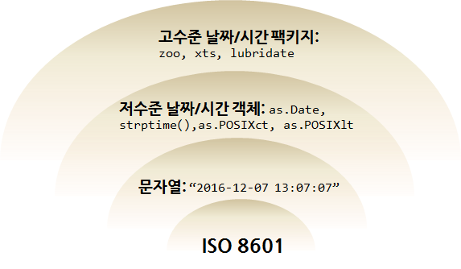

# 날짜와 시간 [^coursera-dates-and-time] {#coursera-date-and-time}

[^coursera-dates-and-time]: [Coursera Lecture 41 - Dates and Times](https://www.coursera.org/learn/r-programming/lecture/yl7BO/dates-and-times)

날짜정보와 시간정보는 R에서 다른 클래스를 통해 구현된다. 
날짜(Date)는 `1970-01-01`을 기준으로 R 내부적으로 정수형으로 저장되고,
시간(Time)도 R 내부적으로 `1970-01-01`을 기준으로 초단위로 저장된다.

- 날짜(Date): `Date` 클래스
- 시간(time): `POSIXct`, `POSIXlt` 클래스
    - `POSIXct` 클래스는 매우 큰 정수로 시간정보를 데이터프레임으로 저장할 때 유용하다.
    - `POSIXlt` 클래스는 리스트 자료형으로 요일, 년, 월, 일 등의 정보를 리스트 내부 원소로 저장되어 유용하다.

**[ISO 8601](https://ko.wikipedia.org/wiki/ISO_8601)** 국제 표준을 근간으로 날짜 및 시간을 문자열로 표현하면 이를 
R에서 인식할 수 있도록 저수준 시간/날짜 객체 변환 함수를 통해 시간/날짜 객체로 변환을 한다.
날짜와 시간 객체로 변환을 하고 나면 고수준 날짜/시간 팩키지를 통해 다양한 날짜/시간 관련 분석작업을 손쉽게 수행한다.

먼저 ISO 8601 기준에 맞춰 문자열("1970-01-01")을 `as.Date` 함수를 통해 날짜 객체로 변환한다.
내부적으로 보면 정수 `0` 으로 저장된다. 기준일 다음 "1970-01-03"일을 보면 숫자 2가 된다.

~~~{.r}
x <- as.Date("1970-01-01")
x
~~~

~~~{.output}
[1] "1970-01-01"

~~~

~~~{.r}
unclass(x)
~~~

~~~{.output}
[1] 0

~~~

~~~{.r}
unclass(as.Date("1970-01-03"))
~~~

~~~{.output}
[1] 2

~~~

## 시간(time) 자료형 확인 {#coursera-time-and-date-class}

`Sys.time()` 함수를 통해 현재 시스템 시간정보를 받아내면 `POSIXct` 클래스임이 확인되고,
`unclass()` 정보를 통해 내부적으로 정수값으로 저장된 것이 확인된다.

~~~{.r}
x <- Sys.time()
x
~~~

~~~{.output}
[1] "2021-08-27 20:35:46 KST"

~~~

~~~{.r}
unclass(x)
~~~

~~~{.output}
[1] 1630064147

~~~

문자열을 받아 `as.POSIXlt()`, `as.POSIXct()` 함수를 사용해서 시간자료형으로 변환시킨다.
`POSIXlt` 자료형으로 변환시킨 경우 리스트로 저장되어 있어 시, 분, 초, 요일등 하위 원소값으로 뽑아낼 수 있다.

~~~{.r}
x <- Sys.time()
x
~~~

~~~{.output}
[1] "2021-08-27 20:35:46 KST"

~~~

~~~{.r}
p <- as.POSIXlt(x)
names(unclass(p))
~~~

~~~{.output}
 [1] "sec"    "min"    "hour"   "mday"   "mon"    "year"   "wday"   "yday"  
 [9] "isdst"  "zone"   "gmtoff"

~~~

~~~{.r}
p$wday
~~~

~~~{.output}
[1] 5

~~~

## 날짜, 시간 자료형 변환 {#coursera-time-and-date-conversion}

결국 문자열을 받아 날짜, 시간 자료형으로 변환시키는데 `strptime()` 함수를 사용한다.
문자열을 입력으로 받아 문자열의 날짜, 시간 형식을 매칭하여 넘기게 되면 날짜, 시간 자료형으로 변환된다.

~~~{.r}
datestring <- c("2006-01-08 10:07:52", "2006-08-07 19:33:02")
x <- strptime(datestring, "%Y-%m-%d %H:%M:%S", tz = "EST5EDT")
x
~~~

~~~{.output}
[1] "2006-01-08 10:07:52 EST" "2006-08-07 19:33:02 EDT"

~~~

~~~{.r}
class(x)
~~~

~~~{.output}
[1] "POSIXlt" "POSIXt" 

~~~

## 날짜, 시간 데이터 기본 연산 {#coursera-basic-operation}

문자열 데이터를 날짜 시간 자료형으로 변환시키게 되면 컴퓨터 내부적으로 윤년, 윤초, 일광절약시간, 표준시간대를 자동으로 계산해 준다.
"2012-03-01", "2012-02-28" 두 날짜사이는 보통 하루 차이가 나지만 윤년이 있는 경우 이틀이 된다. 

~~~{.r}
x <- as.Date("2012-03-01")
y <- as.Date("2012-02-28")
x-y
~~~

~~~{.output}
Time difference of 2 days

~~~

시간이 5시간 차이가 나지만, 표준시간대가 다른 경우 한 시간 차이만 난다.

~~~{.r}
x <- as.POSIXct("2012-10-25 01:00:00")
y <- as.POSIXct("2012-10-25 06:00:00", tz = "GMT")
y - x
~~~

~~~{.output}
Time difference of 14 hours

~~~

# 날짜 시간 R 팩키지 [^r-date-time-packages] [^CRAN-time-series] {#time-and-date-packages}

[^r-date-time-packages]: [Working with xts and quantmod-Leveraging R with xts and quantmod for quantitative trading](http://www.rinfinance.com/RinFinance2009/presentations/xts_quantmod_workshop.pdf)

[^CRAN-time-series]: [CRAN Task View - Time Series Analysis](https://cran.r-project.org/web/views/TimeSeries.html)

날짜와 시간을 다루기 위한 팩키지가 다수 개발되었다. 
`Data` 클래스와 `Time` 클래스를 통해 날짜 뿐만 아니라 시간에 대한 데이터도 처리가 가능하다.
기본적으로 문자열 데이터를 저수준 날짜 및 시간 함수(`as.Date`, `as.POSIXct`, `as.POSIXlt`, `strptime`)를 통해 날짜 및 시간 데이터로 변환시킨 후에 
고수준 날짜 및 시간 팩키지(`zoo`, `xts`, `lubridate`)로 작업을 진행하는 작업흐름을 갖는다. 

> **ISO 8601 - 날짜와 시간 데이터 교환을 위한 국제 표준** [^iso-8601]
> 
> **ISO 8601**(Data elements and interchange formats - Information interchange - Representation of dates and times) 표준은 
> 국제 표준화 기구(ISO)에 의해 공포되었으며 1988년에 처음으로 공개었고, 표준 제정 목적은 
> 날짜와 시간을 표현함에 있어 명백하고 잘 정의된 방법을 제공함으로써, 
> 날짜와 시간의 숫자 표현에 대한 오해를 줄이고자 한다. 보편적 원칙은 다음과 같다.
>  
> - 날짜와 시간 값은 시간 단위의 가장 큰 것부터 가장 작은 것으로 정렬된다: 년도, 월(혹은 주), 일, 시, 분, 초, 그리고 초보다 더 작은 단위.
> - 날짜와 시간은 각각 앞에 0을 붙여서(leading zeros) 유지해야 하는 고정된 자릿수(fixed number of digits)를 갖는다.
> - 표현은 두 가지 형식 중 한 가지로 이루어질 수 있다. 하나는 최소한의 구분자를 이용한 기본 형식이고 다른 하나는 가독성을 높이기 위해 추가된 구분자를 이용한 확장 형식이다. 
>     - 예를 들어, 2009년 1월 6일은 확장 형식으로 "2009-01-06"으로 쓰일 수 있으며, 애매모호함 없이 기본 형식에서는 "20090106"으로 간단히 쓰일 수 있다.
> - 줄어든 정밀도를 위해, 날짜와 시간 표현에서 값들 중 어떤 숫자든지 제외될 수 있으나, 큰 단위가 앞에, 작은 단위가 뒤로 오는 순서는 유지해야 한다. 
>     - 예를 들어, "2004-05"는 2004년 5월을 가르키는 유효한 ISO 8601 날짜이다. 이 형식은 결코 2004년의 지정되지 않은 달의 5일을 표현하는 것이 아니며 2004년부터 2005년 사이의 기간을 말하는 것이 아니다.
> - 특정 애플리케이션에서의 필요성으로, 표준에서는 표현 내에서의 가장 작은 단위의 시간 값에 십진수 기반의 분수를 지원하고 있다.

[^iso-8601]: [위키피디아 - ISO 8601](https://ko.wikipedia.org/wiki/ISO_8601)

## `anytime` 팩키지 {#anytime-package}

 [`anytime`, "anytime: Easier Date and Time Conversion"](https://github.com/eddelbuettel/anytime/): 문자열을 받아 날짜/시간 자료형으로 변환하는데 특화되어 있다.
 

~~~{.r}
library(anytime)
library(tidyverse)

options(digits.secs=6)                ## for fractional seconds below
Sys.setenv(TZ=anytime:::getTZ())      ## 시간대 

anytime:::getTZ()
~~~

~~~{.output}
[1] "Asia/Seoul"

~~~

~~~{.r}
anydate(20160101 + 0:2, tz=anytime:::getTZ())
~~~

~~~{.output}
[1] "2016-01-01" "2016-01-02" "2016-01-03"

~~~
 
## `fasttime` 팩키지 {#anytime-package}

 [`fasttime`, "fasttime: Fast Utility Function for Time Parsing and Conversion"](https://github.com/eddelbuettel/anytime/): 문자열을 받아 날짜/시간 자료형으로 정말 빠르게 변환하는데 특화되어 있다. 이런 경우 문자열이 가능하면 `ISO 8601`에 맞춰 준비되어야 된다.

마이크로 초단위 날짜/시간 데이터를 10,000개 생성시키고 나서 다음 방식으로 파싱해서 자료형을 변환시키는데 소요되는 시간을 비교해보자.

- `lubridate`: `ymd_hms()`
- `base`: `as.POSIXct()`
- `fasttime`: `fastPOSIXct()`
- `lubridate`: `fast_strptime()`

`fasttime` 팩키지는 더이상 유지보수 되고 있지 않고, 이 팩키지를 바탕으로 `lubridate`에서 기능을 흡수하여 명실공히 속도와 편의성을 모두 장착한 시간/날짜 데이터를 다루는 막강한 팩키지로 거듭났습니다. 

~~~{.r}
library(lubridate)
library(fasttime)
~~~

~~~{.output}
Error in library(fasttime): there is no package called 'fasttime'

~~~

~~~{.r}
## 0. 난수 날짜/시간 생성
ts <- as.character(.POSIXct(runif(1e4) * unclass(Sys.time()), tz="Asia/Seoul"))

microbenchmark::microbenchmark(
  ## 1. lubridate로 자료형 변환
  lubridate_ts = ymd_hms(ts, tz="Asia/Seoul"),
  
  ## 2. as.POSIXct로 자료형 변환
  POSITct_ts = as.POSIXct(ts, tz="Asia/Seoul"),
  
  ## 3. fastPOSIXct로 자료형 변환
  fasttime_ts = fastPOSIXct(ts, tz="Asia/Seoul"),
  
  ## 4. fast lubridate로 자료형 변환
  fast_lubridate_ts = fast_strptime(ts, tz="Asia/Seoul", format="%Y-%m-%d %H:%M:%OS"),
  times = 30
)
~~~

~~~{.output}
Error: 'microbenchmark' is not an exported object from 'namespace:microbenchmark'

~~~

# 시간데이터 다루기 {#time-and-date-data-manipulation}

시간정보가 포함된 문자열 데이터 "2016-11-04 10:30:00" 정보를 받아 
`format="%Y-%m-%d %H:%M:%OS"` 문자열 시간 형식을 `strptime()` 함수에 넘기면 문자열 데이터가 시간 데이터로 변환된다.

동영상 데이터를 처리할 경우 프레임 단위(초당 30프레임)로 동영상에 대한 데이터 정보가 저장된 경우, 
이를 시간자료형으로 바꾸는 경우 `seq` 함수를 프레임 단위 `by=`인자로 넘기고, `length.out =`으로 
데이터프레임 길이도 함께 넘긴다. 이를 키값으로 잡고 `as.xts` 함수에 넘기면 xts 객체로 변환된다.
이제 `nseconds`, `nminutes` 함수를 통해 동영상이 몇초인지, 몇분인지 쉽게 확인 가능하게 된다.

~~~{.r}
library(xts)

strptime("2016-11-04 10:30:00", format="%Y-%m-%d %H:%M:%OS")
~~~

~~~{.output}
[1] "2016-11-04 10:30:00 KST"

~~~

~~~{.r}
dat <- read_csv("https://raw.githubusercontent.com/statkclee/identify_age_with_oxford_api/master/03_data/park_emo_01.csv")

dat$times <- strptime("2016-11-04 10:30:00", format="%Y-%m-%d %H:%M:%OS", tz="Asia/Seoul") + seq(1, by = 1/30, length.out = dim(dat)[1])

dat_xts <- as.xts(dat, order.by = dat$times)
nseconds(dat_xts)
~~~

~~~{.output}
[1] 103

~~~

~~~{.r}
nminutes(dat_xts)
~~~

~~~{.output}
[1] 2

~~~

# 시간데이터 파싱 {#time-and-date-parsing}

데이터가 문자열로 저장되어 있고 `년-월-일 오전/오후 시:분:초` 형태를 갖는 시간자료를 R에서 처리하는 작업흐름은 다음과 같다.

1. 데이터가 일관된 형태를 갖는 문자열인지 확인: `년-월-일 오전/오후 시:분:초`
1. 오전/오후 한글을 AM/PM으로 치환
1. `lubridate` 팩키지 `parse_date_time` 함수를 사용해서 시간 자료형으로 변환: `%Y-%m-%d %p %H:%M:%S`
1. 두 시간 사이 지속시간을 계산: `as.period()` 함수를 활용하여 시:분:초 자료형을 유지
1. 지속시간을 익숙한 전체 시간, 분, 초 단위로 변환: as.numeric(processing_duration, unit="hours")

## 시간 데이터 {#time-data-am-pm}

~~~{.r}
date_txt <- structure(list
                      (last_access_time = c("2016-11-02 오전 9:09:45", 
                                           "2016-11-05 오전 12:25:31", "2016-11-04 오전 2:24:46", "2016-11-30 오전 3:17:15", 
                                           "2016-11-10 오전 10:25:01", "2016-11-27 오전 1:40:30", "2016-11-29 오후 5:59:42", 
                                           "2016-11-26 오전 10:48:21", "2016-11-07 오전 8:45:43", "2016-11-27 오후 2:33:26"),
                        register_time = c("2016-11-01 오전 8:55:00", "2016-11-04 오후 3:04:48", 
                                         "2016-11-03 오후 11:36:59", "2016-11-30 오전 1:50:17", "2016-11-10 오전 10:14:51", 
                                         "2016-11-26 오후 1:50:32", "2016-11-29 오후 5:45:26", "2016-11-26 오전 10:37:41", 
                                         "2016-11-06 오후 7:18:34", "2016-11-27 오후 12:08:02")), 
                      .Names = c("last_access_time", "register_time"), 
                      row.names = c(NA, -10L), class = c("tbl_df", "tbl", "data.frame"))

date_txt
~~~

~~~{.output}
# A tibble: 10 x 2
   last_access_time         register_time           
   <chr>                    <chr>                   
 1 2016-11-02 오전 9:09:45  2016-11-01 오전 8:55:00 
 2 2016-11-05 오전 12:25:31 2016-11-04 오후 3:04:48 
 3 2016-11-04 오전 2:24:46  2016-11-03 오후 11:36:59
 4 2016-11-30 오전 3:17:15  2016-11-30 오전 1:50:17 
 5 2016-11-10 오전 10:25:01 2016-11-10 오전 10:14:51
 6 2016-11-27 오전 1:40:30  2016-11-26 오후 1:50:32 
 7 2016-11-29 오후 5:59:42  2016-11-29 오후 5:45:26 
 8 2016-11-26 오전 10:48:21 2016-11-26 오전 10:37:41
 9 2016-11-07 오전 8:45:43  2016-11-06 오후 7:18:34 
10 2016-11-27 오후 2:33:26  2016-11-27 오후 12:08:02

~~~

## 파싱된 시간 데이터 {#time-data-am-pm-parsing}

~~~{.r}
date_txt <- date_txt %>% 
  mutate(last_access_time_old = last_access_time,
         register_time_old = register_time) %>% 
  mutate(last_access_time = ifelse(str_detect(last_access_time, "오전"), 
                                   str_replace(last_access_time, "오전", "AM"), 
                                   str_replace(last_access_time, "오후", "PM")),
         register_time = ifelse(str_detect(register_time, "오전"), 
                                str_replace(register_time, "오전", "AM"), 
                                str_replace(register_time, "오후", "PM"))) %>% 
  mutate(last_access_time = parse_date_time(last_access_time, c("%Y-%m-%d %p %H:%M:%S")),
         register_time = parse_date_time(register_time, c("%Y-%m-%d %p %H:%M:%S")),
         processing_duration = as.period(last_access_time - register_time),
         processing_hours = as.numeric(processing_duration, unit="hours"))
date_txt %>% dplyr::select(register_time, processing_duration, processing_hours) 
~~~

~~~{.output}
# A tibble: 10 x 3
   register_time              processing_duration processing_hours
   <dttm>                     <Period>                       <dbl>
 1 2016-11-01 08:55:00.000000 1d 0H 14M 45S                 24.2  
 2 2016-11-04 15:04:48.000000 9H 20M 43S                     9.35 
 3 2016-11-03 23:36:59.000000 2H 47M 47S                     2.80 
 4 2016-11-30 01:50:17.000000 1H 26M 58S                     1.45 
 5 2016-11-10 10:14:51.000000 10M 10S                        0.169
 6 2016-11-26 13:50:32.000000 11H 49M 58S                   11.8  
 7 2016-11-29 17:45:26.000000 14M 16S                        0.238
 8 2016-11-26 10:37:41.000000 10M 40S                        0.178
 9 2016-11-06 19:18:34.000000 13H 27M 9S                    13.5  
10 2016-11-27 12:08:02.000000 2H 25M 24S                     2.42 

~~~

# 시계열 데이터 [^time-series-data-library] [^tsdl-data-market] {#time-series-data}

[^time-series-data-library]: [Time Series Data Library](http://robjhyndman.com/TSDL/)

[^tsdl-data-market]: [DataMarket - Time Series Data Library](https://datamarket.com/data/list/?q=provider:tsdl)

시계열에 관련된 다양한 데이터는 R 팩키지를 통해 얻을 수 있고, 많은 경우 시계열관련 책에 데이터가 포함되어 있고, 
저자가 팩키지로 만들어 배포하는 형태가 많다.

- [Ecdat - Data Sets for Econometrics](https://cran.r-project.org/web/packages/Ecdat/index.html)
- [Makridakis, Wheelwright and Hyndman (1998) Forecasting: methods and applications](https://cran.r-project.org/web/packages/fma/index.html)
- [Hyndman, Koehler, Ord and Snyder (2008) Forecasting with exponential smoothing](https://cran.r-project.org/web/packages/expsmooth/index.html)
- [Hyndman and Athanasopoulos (2013) Forecasting: principles and practice](https://cran.r-project.org/web/packages/fpp/)
- [Shumway and Stoffer (2011) Applied Statistical Time Series Analysis](https://cran.r-project.org/web/packages/astsa/index.html)
- [Applied Econometrics with R](https://cran.r-project.org/web/packages/AER/index.html)
