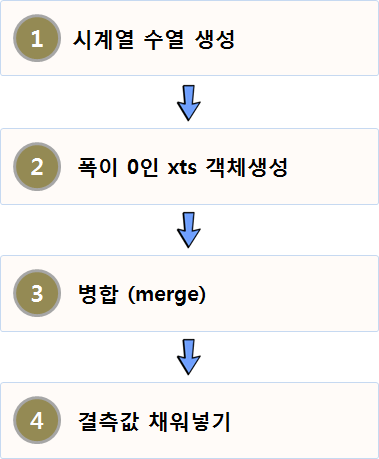

# 불규칙 시계열 데이터 {#time-series-irregular}

시계열 관측점이 균등하게 떨어져서 관측되는 데이터가 보통 통계적 데이터 분석에서 가정하는 시계열 데이터다.
하지만, 휴일이 있거나 대통령선거가 있는 등 특별한 사정으로 인해 시계열 데이터가 빠진 경우가 허다하다.
이러한 불규칙학 시계열 데이터를 균등한 시계열 데이터로 변환하는 방법을 살펴보자.

최종 시계열 자료형을 `xts` 데이터프레임을 가정하고 우선 균등한 시점을 갖는 시계열 수열(sequence)을 생성한다.
균등하게 생성된 시계열 데이터를 너비가 0 인 `xts` 객체를 생성한다.
너비 0인 xts 객체를 불규칙 대상 시계열과 `merge` 명령어를 통해 병합한다. 그러면 당연히 결측값이 생성되는데 이를 
`na.locf` 등을 통해 매꿔넣는다.

텍스트 문자열 벡터를 `ymd_hms` 함수를 활용하여 시계열 데이터 데이터프레임으로 변환을 한다.
`tidyquant` 팩키지 `as_xts` 함수를 통해 표본 데이터프레임을 `xts` 데이터프레임으로 변환시킨다.

2017년 5월은 연휴가 몰려있는데 19대 대통령 보궐선거로 인해 5월 1일부터 5월 9일까지 쉬는 날이 많았다.
관심이 있는 것은 휴가라서 일반 업무일을 결측값으로 만들어 불규칙한 시계열 데이터로 만들어 놓고 이를 규칙적인 
시계열 정상 데이터로 복원시키는 과정을 살펴보자.

`xts` 객체면 `start`, `end` 함수를 통해 시작일과 마지막 날짜를 가져올 수 있다.
이를 `seq` 함수를 통해 규칙적인 수열 날짜를 생성시키고 나서 폭이 0인 `xts` 객체를 생성시킨다.
그리고 `merge` 함수에 결측값을 채워넣는 `na.locf`를 넣어 결측값을 채워넣어 규칙적인 시계열 데이터로 탈바꿈 시킨다.

~~~{.r}
# 0. 환경설정 ----------------------------------
library(tidyquant)
Sys.setenv(TZ="Asia/Seoul")

# 1. 데이터 생성 -------------------------------
ddate <- c("2017-05-01 00:00:00", 
           "2017-05-02 00:00:00",
           "2017-05-03 00:00:00",
           "2017-05-04 00:00:00",
           "2017-05-05 00:00:00",
           "2017-05-06 00:00:00",
           "2017-05-07 00:00:00",
           "2017-05-08 00:00:00",
           "2017-05-09 00:00:00")
holiday <- c(TRUE, FALSE, TRUE, FALSE, TRUE, TRUE, TRUE, FALSE, TRUE)

samp_df <- data.frame(ddate=ddate[holiday], engery=c(1,2,3,4,5,6))

samp_df <- samp_df %>% 
  mutate(ddate = ymd_hms(ddate, tz = "Asia/Seoul"))

samp_xts <- xts(samp_df, order.by = samp_df[,1])

samp_xts
~~~

~~~{.output}
           ddate        engery
2017-05-01 "2017-05-01" "1"   
2017-05-03 "2017-05-03" "2"   
2017-05-05 "2017-05-05" "3"   
2017-05-06 "2017-05-06" "4"   
2017-05-07 "2017-05-07" "5"   
2017-05-09 "2017-05-09" "6"   

~~~

~~~{.r}
# 2. 시계열 데이터 정규화 -------------------------
## 2.1. 시작과 끝 뽑아내기
start_date <- start(samp_xts)
end_date <- end(samp_xts)

## 2.2. 규칙적인 시계열 수열 생성
regular_index <- seq(start_date,
                     end_date,
                     by="day")

## 2.3. 0 폭을 갖는 xts 시계열 객체 생성
regular_xts <- xts(x=NULL, order.by=regular_index)

## 2.4. [병합] 불규칙 xts 시계열 데이터를 규칙 xts 시계열 데이터와 병합
(m_xts <- merge(samp_xts, regular_xts))
~~~

~~~{.output}
           ddate        engery
2017-05-01 "2017-05-01" "1"   
2017-05-02 NA           NA    
2017-05-03 "2017-05-03" "2"   
2017-05-04 NA           NA    
2017-05-05 "2017-05-05" "3"   
2017-05-06 "2017-05-06" "4"   
2017-05-07 "2017-05-07" "5"   
2017-05-08 NA           NA    
2017-05-09 "2017-05-09" "6"   

~~~

~~~{.r}
## 2.5. [결측값 복원] 결측된 시계열 관측점을 이전/이후 관측점을 이용하여 채워넣기

(m_filled_xts <- merge(samp_xts, regular_xts, fill=na.locf))
~~~

~~~{.output}
           ddate        engery
2017-05-01 "2017-05-01" "1"   
2017-05-02 "2017-05-01" "1"   
2017-05-03 "2017-05-03" "2"   
2017-05-04 "2017-05-03" "2"   
2017-05-05 "2017-05-05" "3"   
2017-05-06 "2017-05-06" "4"   
2017-05-07 "2017-05-07" "5"   
2017-05-08 "2017-05-07" "5"   
2017-05-09 "2017-05-09" "6"   

~~~

# 고빈도 데이터에서 총계 {#time-series-high-frequency}

고빈도 데이터(High Frequency Data)는 고빈도거래(High Frequency Trading)으로 일반인에게 잘 알려져 있고,
알고리즘 트레이딩(Algorithmic Trading)으로 컴퓨터 프로그램을 이용, 일정한 논리구조(알고리즘)에 따라 증권, 파생상품, 외환 등 유동성 자산을 자동으로 거래하는 매매 방식으로 
사람이 개입하기는 하지만, 전통적인 의미와는 많이 다르다.

고빈도 데이터는 초단위로 데이터가 수집되기 때문에 의미있는 단위 즉, 10초 간격, 1분, 혹은 10분, 한 시간 단위로 총계를 낼 필요가 있다.
이런 경우 `xts` 팩키지 자료형에서 `to.period` 함수를 통해 원하는 결과를 얻을 수 있다.
고빈도 데이터 표본이 `highfrequency` 팩키지에 포함되어 있다. `data("sample_tdataraw")` 명령어를 실행하면 "2008-01-04 09:30:26" 부터 
"2008-01-04 16:00:00"까지 하룻동안 NYSE 거래된 특정 주식에 대한 거래내역이 NYSE 표준형식으로 저장되어 있다.

원데이터는 거래가격과 주식수가 문자열로 되어 있어, 이에 해당되는 열만 뽑아내고 `storage.mode` 명령어를 통해 숫자형으로 변환시킨 후 작업을 수행한다. [^xts-convert]

[^xts-convert]: [Convert character to numeric in xts object](http://stackoverflow.com/questions/28135210/convert-character-to-numeric-in-xts-object)

~~~{.r}
# 0. 환경설정 ----------------------------------
#install.packages("cubature")
#devtools::install_github("jonathancornelissen/highfrequency")
library(highfrequency)
~~~

~~~{.output}
Error in library(highfrequency): there is no package called 'highfrequency'

~~~

~~~{.r}
# 1. 데이터 가져오기 --------------------------------
data("sample_tdataraw")

stock_hfd <- sample_tdataraw[,c("PRICE", "SIZE")]
~~~

~~~{.output}
Error in eval(expr, envir, enclos): object 'sample_tdataraw' not found

~~~

~~~{.r}
# http://stackoverflow.com/questions/28135210/convert-character-to-numeric-in-xts-object
storage.mode(stock_hfd) <- "numeric"
~~~

~~~{.output}
Error in storage.mode(stock_hfd) <- "numeric": object 'stock_hfd' not found

~~~

~~~{.r}
# 2. 데이터 변환 ------------------------------------
## 2.1. 10초
xts_10sec <- to.period(stock_hfd, period = "seconds", k = 10)
~~~

~~~{.output}
Error in to.period(stock_hfd, period = "seconds", k = 10): object 'stock_hfd' not found

~~~

~~~{.r}
head(xts_10sec)
~~~

~~~{.output}
Error in head(xts_10sec): object 'xts_10sec' not found

~~~

~~~{.r}
## 2.2. 10분
xts_10min <-to.period(stock_hfd, period = "minutes", k =10)
~~~

~~~{.output}
Error in to.period(stock_hfd, period = "minutes", k = 10): object 'stock_hfd' not found

~~~

~~~{.r}
tail(xts_10min)
~~~

~~~{.output}
Error in tail(xts_10min): object 'xts_10min' not found

~~~

~~~{.r}
## 2.3. 1시간
xts_1hour <- to.period(stock_hfd, period = "hours", k = 1)
~~~

~~~{.output}
Error in to.period(stock_hfd, period = "hours", k = 1): object 'stock_hfd' not found

~~~

~~~{.r}
head(xts_1hour)
~~~

~~~{.output}
Error in head(xts_1hour): object 'xts_1hour' not found

~~~

# 고빈도 데이터 split-apply-combine 전략 [^datacamp-split-apply-combine] {#high-frequency-split-apply-combine}

[^datacamp-split-apply-combine]: [Importing and Managing Financial Data in R](https://www.datacamp.com/courses/importing-and-managing-financial-data-in-r)

데이터 캠프 [Importing and Managing Financial Data in R](https://www.datacamp.com/courses/importing-and-managing-financial-data-in-r)에서 
사용된 데이터를 가져온다.
일자별로 매초마다 거래기록이 저장되어 있지 않고 `NA` 값으로 채워져 있다. 일자별로 `na.locf` 방식으로 결측값을 채워넣는데 
**split-apply-combine** 전략을 사용한다. 

`split` 함수로 `xts` 객체를 일별 그룹으로 나누고 나서 `na.locf` 함수를 일자별로 적용하고 나서 `do.call` 함수를 호출해서 `rbind`로 쌓아서 `xts` 데이터프레임으로 다시 되돌린다.

~~~{.r}
# 1. 데이터 가져오기 --------------------------------

target_df <- structure(c(NA, NA, NA, NA, NA, NA, 1, NA, NA, NA, 2, NA, NA, 
            NA, NA, 7, NA, NA, NA, 8, NA, NA, NA, NA, NA, NA, NA, NA, NA, 
            NA, NA, NA, NA, NA, NA, NA, NA, NA, NA, NA, 11, NA, NA, NA, NA, 
            NA, NA, NA, NA, NA, NA, NA, NA, NA, NA, NA, NA, NA, NA, NA, NA, 
            NA, NA, NA, NA, NA, NA, NA, NA, NA, NA, NA, NA, NA, NA), 
            class = c("xts", "zoo"), .indexCLASS = c("POSIXct", "POSIXt"), .indexTZ = "", 
            tclass = c("POSIXct", "POSIXt"), tzone = "", 
            index = structure(c(1262595600, 1262597400, 
                    1262599200, 1262601000, 1262602800, 1262604600, 1262606400, 1262608200, 
                    1262610000, 1262611800, 1262613600, 1262615400, 1262617200, 1262619000, 
                    1262620800, 1262682000, 1262683800, 1262685600, 1262687400, 1262689200, 
                    1262691000, 1262692800, 1262694600, 1262696400, 1262698200, 1262700000, 
                    1262701800, 1262703600, 1262705400, 1262707200, 1262768400, 1262770200, 
                    1262772000, 1262773800, 1262775600, 1262777400, 1262779200, 1262781000, 
                    1262782800, 1262784600, 1262786400, 1262788200, 1262790000, 1262791800, 
                    1262793600, 1262854800, 1262856600, 1262858400, 1262860200, 1262862000, 
                    1262863800, 1262865600, 1262867400, 1262869200, 1262871000, 1262872800, 
                    1262874600, 1262876400, 1262878200, 1262880000, 1262941200, 1262943000, 
                    1262944800, 1262946600, 1262948400, 1262950200, 1262952000, 1262953800, 
                    1262955600, 1262957400, 1262959200, 1262961000, 1262962800, 1262964600, 
                    1262966400), 
            tzone = "", tclass = c("POSIXct", "POSIXt")), .Dim = c(75L, 1L), .Dimnames = list(NULL, "data"))
             

target_df
~~~

~~~{.output}
                    data
2010-01-04 18:00:00   NA
2010-01-04 18:30:00   NA
2010-01-04 19:00:00   NA
2010-01-04 19:30:00   NA
2010-01-04 20:00:00   NA
2010-01-04 20:30:00   NA
2010-01-04 21:00:00    1
2010-01-04 21:30:00   NA
2010-01-04 22:00:00   NA
2010-01-04 22:30:00   NA
2010-01-04 23:00:00    2
2010-01-04 23:30:00   NA
2010-01-05 00:00:00   NA
2010-01-05 00:30:00   NA
2010-01-05 01:00:00   NA
2010-01-05 18:00:00    7
2010-01-05 18:30:00   NA
2010-01-05 19:00:00   NA
2010-01-05 19:30:00   NA
2010-01-05 20:00:00    8
2010-01-05 20:30:00   NA
2010-01-05 21:00:00   NA
2010-01-05 21:30:00   NA
2010-01-05 22:00:00   NA
2010-01-05 22:30:00   NA
2010-01-05 23:00:00   NA
2010-01-05 23:30:00   NA
2010-01-06 00:00:00   NA
2010-01-06 00:30:00   NA
2010-01-06 01:00:00   NA
2010-01-06 18:00:00   NA
2010-01-06 18:30:00   NA
2010-01-06 19:00:00   NA
2010-01-06 19:30:00   NA
2010-01-06 20:00:00   NA
2010-01-06 20:30:00   NA
2010-01-06 21:00:00   NA
2010-01-06 21:30:00   NA
2010-01-06 22:00:00   NA
2010-01-06 22:30:00   NA
2010-01-06 23:00:00   11
2010-01-06 23:30:00   NA
2010-01-07 00:00:00   NA
2010-01-07 00:30:00   NA
2010-01-07 01:00:00   NA
2010-01-07 18:00:00   NA
2010-01-07 18:30:00   NA
2010-01-07 19:00:00   NA
2010-01-07 19:30:00   NA
2010-01-07 20:00:00   NA
2010-01-07 20:30:00   NA
2010-01-07 21:00:00   NA
2010-01-07 21:30:00   NA
2010-01-07 22:00:00   NA
2010-01-07 22:30:00   NA
2010-01-07 23:00:00   NA
2010-01-07 23:30:00   NA
2010-01-08 00:00:00   NA
2010-01-08 00:30:00   NA
2010-01-08 01:00:00   NA
2010-01-08 18:00:00   NA
2010-01-08 18:30:00   NA
2010-01-08 19:00:00   NA
2010-01-08 19:30:00   NA
2010-01-08 20:00:00   NA
2010-01-08 20:30:00   NA
2010-01-08 21:00:00   NA
2010-01-08 21:30:00   NA
2010-01-08 22:00:00   NA
2010-01-08 22:30:00   NA
2010-01-08 23:00:00   NA
2010-01-08 23:30:00   NA
2010-01-09 00:00:00   NA
2010-01-09 00:30:00   NA
2010-01-09 01:00:00   NA

~~~

~~~{.r}
# 2. Split-Apply-Combine 전략 ---------------------------------------------------
## 2.1. 쪼개기(split)
day_lst <- split(target_df , f = "days")

## 2.2. 적용(apply) 
day_filled_lst <- lapply(day_lst, FUN = na.locf)

## 2.3. 결합(combine) 
(target_fill_df <- do.call(rbind, day_filled_lst))
~~~

~~~{.output}
                    data
2010-01-04 18:00:00   NA
2010-01-04 18:30:00   NA
2010-01-04 19:00:00   NA
2010-01-04 19:30:00   NA
2010-01-04 20:00:00   NA
2010-01-04 20:30:00   NA
2010-01-04 21:00:00    1
2010-01-04 21:30:00    1
2010-01-04 22:00:00    1
2010-01-04 22:30:00    1
2010-01-04 23:00:00    2
2010-01-04 23:30:00    2
2010-01-05 00:00:00   NA
2010-01-05 00:30:00   NA
2010-01-05 01:00:00   NA
2010-01-05 18:00:00    7
2010-01-05 18:30:00    7
2010-01-05 19:00:00    7
2010-01-05 19:30:00    7
2010-01-05 20:00:00    8
2010-01-05 20:30:00    8
2010-01-05 21:00:00    8
2010-01-05 21:30:00    8
2010-01-05 22:00:00    8
2010-01-05 22:30:00    8
2010-01-05 23:00:00    8
2010-01-05 23:30:00    8
2010-01-06 00:00:00   NA
2010-01-06 00:30:00   NA
2010-01-06 01:00:00   NA
2010-01-06 18:00:00   NA
2010-01-06 18:30:00   NA
2010-01-06 19:00:00   NA
2010-01-06 19:30:00   NA
2010-01-06 20:00:00   NA
2010-01-06 20:30:00   NA
2010-01-06 21:00:00   NA
2010-01-06 21:30:00   NA
2010-01-06 22:00:00   NA
2010-01-06 22:30:00   NA
2010-01-06 23:00:00   11
2010-01-06 23:30:00   11
2010-01-07 00:00:00   NA
2010-01-07 00:30:00   NA
2010-01-07 01:00:00   NA
2010-01-07 18:00:00   NA
2010-01-07 18:30:00   NA
2010-01-07 19:00:00   NA
2010-01-07 19:30:00   NA
2010-01-07 20:00:00   NA
2010-01-07 20:30:00   NA
2010-01-07 21:00:00   NA
2010-01-07 21:30:00   NA
2010-01-07 22:00:00   NA
2010-01-07 22:30:00   NA
2010-01-07 23:00:00   NA
2010-01-07 23:30:00   NA
2010-01-08 00:00:00   NA
2010-01-08 00:30:00   NA
2010-01-08 01:00:00   NA
2010-01-08 18:00:00   NA
2010-01-08 18:30:00   NA
2010-01-08 19:00:00   NA
2010-01-08 19:30:00   NA
2010-01-08 20:00:00   NA
2010-01-08 20:30:00   NA
2010-01-08 21:00:00   NA
2010-01-08 21:30:00   NA
2010-01-08 22:00:00   NA
2010-01-08 22:30:00   NA
2010-01-08 23:00:00   NA
2010-01-08 23:30:00   NA
2010-01-09 00:00:00   NA
2010-01-09 00:30:00   NA
2010-01-09 01:00:00   NA

~~~

