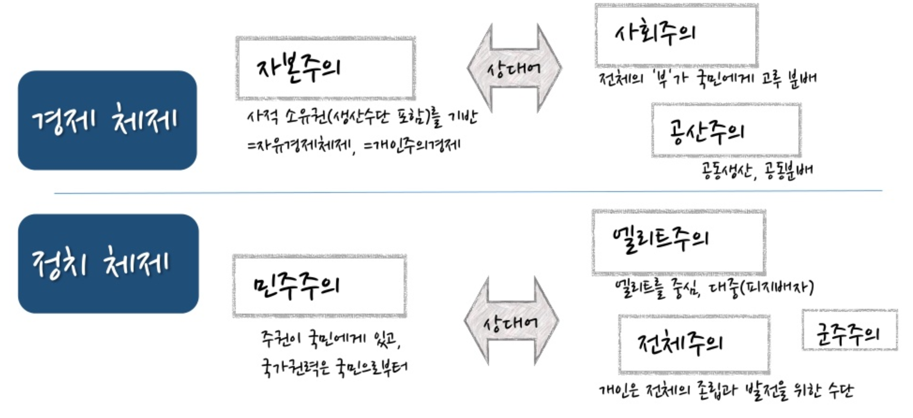

```{r setup, include=FALSE}
knitr::opts_chunk$set(echo = TRUE, message=FALSE, warning=FALSE,
                      comment="", digits = 3, tidy = FALSE, prompt = FALSE, fig.align = 'center')
```

# 자본주의 [^capitalism-plusjune] {#capitalism}

[^capitalism-plusjune]: [이승준, 자본주의(Capitalism)](https://www.slideshare.net/plusjune?utm_campaign=profiletracking&utm_medium=sssite&utm_source=ssslideview)

민주주의는 정치체제, 공산주의는 경제체제를 지칭합니다.

- 경제체제
    - 자본주의 [^wikipedia-capitalism]: 재화의 사적 소유권을 사회 구성원의 양도 불가능한 기본권으로 인정하는 사회 구성체이다. 사회주의적 관점에서 볼 때, 생산 수단을 가진 자본가 및 기업가 계급이 
    이익 추구를 위해 생산 활동을 하도록 보장하는 사회 경제 체제로 정의하기도 한다. 재화의 사적 소유권에 대한 인정은 곧바로 재화의 매매, 양도, 소비 및 이윤의 처분 등에 대한 결정을 개인에게 일임하는 것이기 때문에 자본주의는 사적 소유권을 기반으로한 경제 체제이기도 하다. 자본주의 경제 체계에서는 상품 또는 용역의 가격, 투자, 분배 등이 주로 시장 경제를 통해 이루어진다.
- 정치체제
    - 민주주의: 국가의 주권이 국민에게 있고 국민이 권력을 가지고 그 권력을 스스로 행사하며 국민을 위하여 정치를 행하는 제도, 또는 그러한 정치를 지향하는 사상이다.

[^wikipedia-capitalism]: [위키백과, "자본주의"](https://ko.wikipedia.org/wiki/%EC%9E%90%EB%B3%B8%EC%A3%BC%EC%9D%98)



자본은 우회생산(Round-about Method of Production) 즉, 중간 생산재를 이용하여 최종소비재의 생산을 증가시키는 생산방식이다.
산업혁명(Industrial Revolution)은 18세기 중반부터 19세기 초반까지, 
약 1760년에서 1820년 사이에 영국에서 시작된 기술의 혁신과 새로운 제조 공정(manufacturing process)으로의 전환, 이로 인해 일어난 사회, 경제 등의 큰 변화를 일컫는다. 
한마디로 요약하면, "노동 생산성(labor productivity)"에서 "자본 생산성(capital productivity)"으로 이동했다.


# 돈(Money) = 부채(Debt) {#capitalism-debt}

돈은 우리말이며 한자로 화폐라고 동의어가 된다. 즉, "돈 = 화폐".
네이버 사전에 따르면, [돈](https://ko.dict.naver.com/#/entry/koko/a719d5b9552c4587b98ef4acdc2e6738)은 사물의 가치를 나타내며, 상품의 교환을 매개하고, 재산 축적의 대상으로도 사용하는 물건. 
예전에는 조가비, 짐승의 가죽, 보석, 옷감, 농산물 따위를 이용하였으나 
요즈음은 금, 은, 동 따위의 금속이나 종이를 이용하여 만들며 그 크기나 모양, 액수 따위는 일정한 법률에 의하여 정한다.
네이버 사전에 따르면, [화폐(貨幣)](https://ko.dict.naver.com/#/entry/koko/4f25dde7a0d042feb2044aeb2e51851f)는 상품 교환 가치의 척도가 되며 그것의 교환을 매개하는 일반화된 수단. 주화, 지폐, 은행권 따위가 있다.

[통화(通貨)](https://ko.dict.naver.com/#/entry/koko/8dfe212762ea4f2fb042591c3135324b)는 유통 수단이나 지불 수단으로서 기능하는 화폐. 본위 화폐, 은행권, 보조 화폐, 정부 지폐, 예금 통화 따위가 있다. 통화는 지불에 대한 약속으로 신용(Credit) 즉 빚(debt)이다.

<iframe width="300" height="180" src="https://www.youtube.com/embed/Sj40eWKu-FY" frameborder="0" allow="accelerometer; autoplay; encrypted-media; gyroscope; picture-in-picture" allowfullscreen></iframe>

# 은행 {#capitalism-bank}


# 경제 사상가들 {#capitalism-economist}

- 아담 스미스
- 칼 마르크스
- 케인즈 
- 하이에크
- 

## [세기의 대결 - 케인즈 vs 하이에크](https://namu.wiki/w/%EC%84%B8%EA%B8%B0%EC%9D%98%20%EB%8C%80%EA%B2%B0%20-%20%EC%BC%80%EC%9D%B8%EC%A6%88%20vs%20%ED%95%98%EC%9D%B4%EC%97%90%ED%81%AC) {#capitalism-economist-the-greatest}

[유튜브 채널 - `EconStories`](https://www.youtube.com/user/econstories)

<div class = "row">
  <div class = "col-md-6">
**"Fear the Boom and Bust": Keynes vs. Hayek Rap Battle**

<iframe width="300" height="180" src="https://www.youtube.com/embed/d0nERTFo-Sk" frameborder="0" allow="accelerometer; autoplay; encrypted-media; gyroscope; picture-in-picture" allowfullscreen></iframe>

  </div>
  <div class = "col-md-6">
**"Fight of the Century": Keynes vs. Hayek Rap Battle Round Two**

<iframe width="300" height="180" src="https://www.youtube.com/embed/GTQnarzmTOc" frameborder="0" allow="accelerometer; autoplay; encrypted-media; gyroscope; picture-in-picture" allowfullscreen></iframe>
  </div>
</div>


