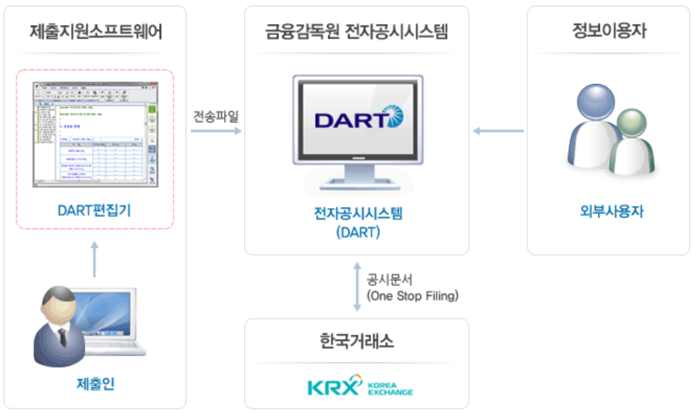

```{r setup, include=FALSE}
knitr::opts_chunk$set(echo = TRUE, message=FALSE, warning=FALSE,
                      comment="", digits = 3, tidy = FALSE, prompt = FALSE, fig.align = 'center')

library(tidyverse)

Sys.setenv(RETICULATE_PYTHON = "C:/Users/statkclee/anaconda3")

library(reticulate)
# reticulate::use_python(Sys.which("python"))
reticulate::repl_python()
repl_py
```

# DART {#about-dart}

**전자공시시스템(DART ; Data Analysis, Retrieval and Transfer System)**은 (비)상장법인 등이 공시서류를 인터넷으로 제출하고, 투자자 등 이용자는 제출 즉시 인터넷을 통해 조회할 수 있도록 하는 종합적 기업공시 시스템으로 금융감독원에서 운영하고 있다. [대한민국 기업정보의 창 DART](http://dart.fss.or.kr/)



# DART APIKEY {#about-dart-apikey}


```{r apikey, eval = FALSE}
library(tidyverse)
library(httr)
library(rvest)

```


