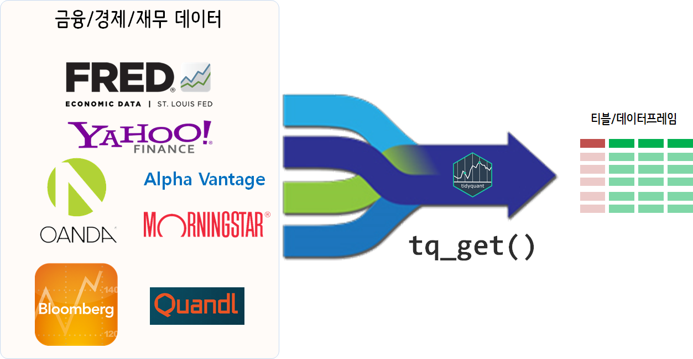

```{r, include=FALSE}
source("tools/chunk-options.R") 
library(tidyverse)
library(tidyquant)
library(timetk)
library(sweep)
library(extrafont)
library(forecast)
loadfonts()

options("getSymbols.yahoo.warning"=FALSE)
```

# `tidyquant` 데이터 가져오기 [^tidyquant-intro] {#tidyquant-data-get}

[^tidyquant-intro]: [tidyquant - Core Functions in tidyquant](https://cran.r-project.org/web/packages/tidyquant/vignettes/TQ01-core-functions-in-tidyquant.html)

`tidyquant` 팩키지 `tq_get()` 함수를 통해 다양한 소스(source)를 통해 금융, 경제, 재무 데이터를 손쉽게 가져올 수 있다.

> **금융/경제/재무 데이터 저장소**
> 
> - 야후 금융: [https://finance.yahoo.com/](https://finance.yahoo.com/)
> - ~~구글 금융~~: [https://www.google.com/finance](https://www.google.com/finance), 2018년 3월부터 금융데이터 제공 안됨.
> - 블룸버그(Bloomberg): [Rblpapi: R Interface to 'Bloomberg'](https://cran.r-project.org/web/packages/Rblpapi/index.html)
> - Alpha Vantage: [실시간, 과거 주식, 환율, 암호화폐 시세 정보](https://www.alphavantage.co/)
> - 모닝스타(Morningstar): [기술분석지표(Key Ratios & Key Stats)](http://www.morningstar.com/)
> - OANDA 환율: [https://www.oanda.com/](https://www.oanda.com/)
>     - `quantmod::oanda.currencies` 각국환종에 대한 요약표를 제공
> - 경제 데이터: [https://fred.stlouisfed.org/](https://fred.stlouisfed.org/)

과거 `quantmod`, `quandl` 팩키지를 활용하여 많이 사용되는 금융데이터를 다양한 곳에서 R로 바로 불러올 수 있다.
예를 들어, `quantmod` 팩키지 `getSymbols()` 함수는 **Yahoo! Finance**, **Google Finance**, **FRED**, **Oanda** 등에서 
바로 데이터를 원하는 형태로 가져오고 가져온 데이터는 기본적으로 `xts` 자료구조로 일관되게 후속처리를 할 수 있었다면,
이제 `tq_get()` 함수를 통해서 동일하게 데이터를 가져와서 작업을 수행할 수 있다.




# 금융/경제/재무 데이터 {#quantmod-quandl-import}

종합주가지수(Kospi)에 대해 구글 금융 웹사이트 검색창에 `kospi`를 타이핑하면 **KRX:KOSPI** 이 확인된다.
이를 해당 기간에 맞춰 가져온다. [야후 금융(Yahoo Finance)](https://finance.yahoo.com)에서 
SK 이노베이션 주식을 검색하면 `096770.KS` 코드가 확인된다.
마찬가지로 방법으로 환율은 `oanda` 웹사이트에서 불러오는데
환종을 확인해야 한다. 환종정보는 `quantmod::oanda.currencies`에서 주요국에 대한 환종을 확인한다.
마찬가지로 대한민국 실업률도 `FRED` 웹사이트에 검색하게 되면 `LRHUTTTTKRA156N` 확인된다.
이를 가져와서 시각화한다.

## 인덱스 및 주식거래소 {#tidyquant-index-se}

`tq_index_options()`, `tq_exchange_options()` 함수를 사용해서 인덱스 데이터와 주식거래소(Stock Exchanges) 데이터를 가져온다.
다만, 자바 의존성이 있어 자바환경을 맞춰 설치하고 `XLConnect` 팩키지를 연결하면 된다.

``` {r financial-data-sources-index, eval = FALSE}

# 0. 환경설정 -----
library(tidyverse)
library(tidyquant)
library(XLConnect)
library(timetk)
library(sweep)
library(extrafont)
library(forecast)
loadfonts()

# 1. 주식 데이터 -----
## 1.1. 인덱스 데이터
tq_index_options()
# down_df <- tq_index("SP500")

## 1.2. 주식거래소(Stock Exchanges)
tq_exchange_options()
# tq_exchange("NASDAQ")
```

## 주식 {#tidyquant-index-se}

주식관련하여 주가 정보 및 재무제표, 기술분석지표가 차례로 제공되고 있다.

<style>
div.blue { background-color:#e6f0ff; border-radius: 5px; padding: 10px;}
</style>
<div class = "blue">

Google Finance stopped providing data in March, 2018.
You could try setting src = "yahoo" instead.

</div>

SK 이노베이션 주식은 앞서 확인한 `096770.KS`으로 "2010-01-01" 시점부터 현재까지 주식시세 데이터를 가져온다.
재무제표는 `tq_get()` 함수에 인자로 `get = "financials"`, 기술분석지표(Key Ratios & Key Stats)는 `get = "key.ratios"`
명령어로 가져올 수 있다.

``` {r financial-data-sources-stock}
## 1.3. 주식 데이터
ski_prices  <- tq_get("096770.KS", get = "stock.prices", from = "2010-01-01")
ski_prices 

## 1.4. 재무제표
aapl_financials <- tq_get("AAPL", get = "financials")

## 1.5. 기술분석지표(Key Ratios & Key Stats)
appl_key_ratios <- tq_get("AAPL", get = "key.ratios")
appl_key_ratios
```

## 원자재 {#tidyquant-index-raw-material}

원자재 가격은 WTI 원유가격은 `quandl`을 통해 가져올 수 있고,
자료제공 기간의 한계가 있기 때문에 [FRED](https://fred.stlouisfed.org/)를 통해 데이터를 가져오는 것도 가능하다.

``` {r financial-data-sources-oil}
# 2. 원자재 -----

# quandl_api_key(quandl_apikey)
# quandl_search(query = "Oil", database_code = "NSE", per_page = 3)

# 3. 경제데이터 -----
## 3.1. WTI 원유가격
wti_price_usd <- tq_get("DCOILWTICO", get = "economic.data")
wti_price_usd 
```

## 환율 {#tidyquant-index-fx}

[FRED](https://fred.stlouisfed.org/)에서 제공하는 환율정보도 가져오는 것이 가능한데 
`get = "exchange.rates"`을 설정하고 해당 환종을 지정하면 환율데이터를 쉽게 가져올 수 있다.

``` {r financial-data-sources-fx}
## 3.2. 환율 데이터
usd_krw <- tq_get("USD/KRW", 
                  get = "exchange.rates", 
                  from = Sys.Date() - lubridate::days(10))
usd_krw
```

## 귀금속 {#tidyquant-index-stone}

[FRED](https://fred.stlouisfed.org/)에서 제공하는 귀금속 정보도 가져올 수 있다.
`get = "metal.prices"`을 설정하고 해당 귀금속, 예를 들어 XAU(gold), XAG(silver), XPD(palladium), XPT (platinum)을 지정하면 귀금속 데이터를 쉽게 가져올 수 있다.

``` {r financial-data-sources-metal}
## 3.3. 금속 데이터
gold_price_krw <- tq_get("gold", get = "metal.prices", 
                         from = Sys.Date() - lubridate::days(10),
                         base.currency = "KRW")
gold_price_krw
```

## 거시경제 지표 {#tidyquant-index-economic-indicator}

대한민국 실업률도 FRED 웹사이트에 검색하게 되면 `LRHUTTTTKRA156N` 확인된다.
대한민국 현시점(`r Sys.Date()`) 이후 12개월 예측 실업률에 대한 자세한 사항은 [데이터 과학 – 금융(Finance), 실업률 예측 - tidyquant](https://statkclee.github.io/finance/ts-unemployment-tidyquant.html)을 참조한다.

``` {r financial-data-sources-unemploy}
# 1. 데이터 -----
unemp_tbl <- tq_get("LRUN64TTKRM156N", 
                            get  = "economic.data", 
                            from = "2000-01-01",
                            to   = Sys.Date())
(unemp_tbl <- unemp_tbl %>% 
  rename(실업률 = price,
            연월 = date))
```            