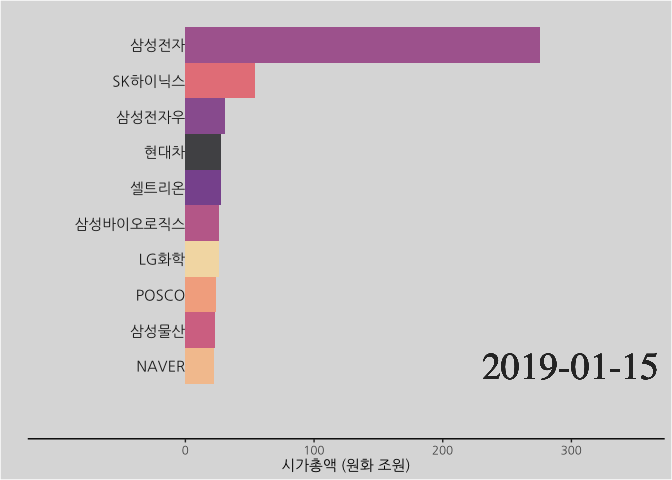

```{r, include=FALSE}
knitr::opts_chunk$set(echo = TRUE, warning=FALSE, message=FALSE,
                    comment="", digits = 3, tidy = FALSE, prompt = FALSE, fig.align = 'center')

```


# 데이터 {#finance-kr-dataset}

[데이터셋 - 시가총액 데이터](https://financedata.github.io/marcap/)는 [FinanceData.KR](https://web.facebook.com/financedata) 이승준 대표님이 한국거래소 홈페이지를 통해서 얻을 수 있는 정보를 개발자가 사용하기 편한 상태로 GitHub에 공개하여 활용할 수 있게 도움을 주고 있다.

## GitHub &rarr; {#get-github-dataset}

먼저 다음 명령어로 로컬 컴퓨터에 저장시킨다.

```{bash get-github, eval = FALSE}
git clone "https://github.com/FinanceData/marcap.git" marcap
```

다음으로 파이썬 유틸리티 함수를 사용해서 경주하는 막대그래프를 제작하는데 용이한 형태로 데이터를 변환시키는 것도 가능한데 `marcap` 파이썬 데이터 팩키지를 자세히 보면 원본 데이터는 압축한 `.csv` 파일이라 바로 `tidyverse` `read_csv()` 함수를 사용해서 읽어들일 수가 있다. 

## 1년치 데이터 {#read-one-year}

가장 최근 2019년 시가총액 데이터를 읽어와서 상위 10개 상장사 월별 시가총액을 구해보자.

```{r get-data}
library(tidyverse)

df <- read_csv("marcap/data/marcap-2019.csv.gz")

month_df <- df %>%
  janitor::clean_names() %>% 
  mutate(marcap = round(marcap / 10^12, 1)) %>% 
  mutate(yearmon = format(date, "%Y-%m")) %>% 
  group_by(name, yearmon) %>% 
  arrange(date) %>% 
  slice(n()) %>% 
  ungroup()

month_10_df <- month_df %>% 
  group_by(yearmon) %>% 
  top_n(10, marcap) %>% 
  select(name, marcap, yearmon, rank) %>% 
  ungroup() 

month_10_df %>% 
  arrange(rank) %>% 
  DT::datatable()
```

## 함수 {#read-one-year-function}

### 인자없는 함수 {#read-one-year-function-no-argv}

다음으로 상위 10개 상장사를 뽑아내는 함수를 만들어보자. 먼저 앞서 작성한 스크립트를 인자를 받지 않는 함수로 작성한다. 그리고 나서 함수를 호출하여 결과값을 비교한다.

```{r get-data-function}

get_10_marcap <- function() {
  year_df <- read_csv("marcap/data/marcap-2019.csv.gz")

  year_month_df <- year_df %>%
    janitor::clean_names() %>% 
    mutate(marcap = round(marcap / 10^12, 1)) %>% 
    mutate(yearmon = format(date, "%Y-%m")) %>% 
    group_by(name, yearmon) %>% 
    arrange(date) %>% 
    slice(n()) %>% 
    ungroup()
  
  year_month_10_df <- year_month_df %>% 
    group_by(yearmon) %>% 
    top_n(10, marcap) %>% 
    select(name, marcap, yearmon, rank) %>% 
    ungroup() %>% 
    arrange(rank)
  
  return(year_month_10_df)
}

sample_df <- get_10_marcap()

sample_df %>% 
  DT::datatable()
```

### 연도인자 함수 {#read-one-year-function-year-argv}

다음으로 연도 인자를 받는 함수를 작성해서 테스트 해 본다.

```{r get-data-function-test-argv}

get_10_marcap <- function(marcap_data) {
  year_df <- read_csv(marcap_data)

  year_month_df <- year_df %>%
    janitor::clean_names() %>% 
    mutate(marcap = round(marcap / 10^12, 1)) %>% 
    mutate(yearmon = format(date, "%Y-%m")) %>% 
    group_by(name, yearmon) %>% 
    arrange(date) %>% 
    slice(n()) %>% 
    ungroup()
  
  year_month_10_df <- year_month_df %>% 
    group_by(yearmon) %>% 
    top_n(10, marcap) %>% 
    select(name, marcap, yearmon, rank) %>% 
    ungroup() %>% 
    arrange(rank)
  
  return(year_month_10_df)
}

sample_argv_df <- get_10_marcap("marcap/data/marcap-2019.csv.gz")

sample_argv_df %>% 
  DT::datatable()
```

## 반복 {#read-loop}

### 반복 준비 {#read-loop-ready}

연도별 인자를 받는 함수를 작성했기 때문에 연도별 파일을 넣어주고 이를 해당연도만큼 반복을 하면 원하는 데이터를 얻을 수가 있다. 이를 위해서 함수 인자로 넣어줄 연도별 파일인자를 정의하는 작업이 추가된다. `fs` 팩키지를 바탕으로 연도별 시가총액 데이터가 들어있는 디렉토리를 찾아 디렉토리명이 포함된 파일명(`file_name`)을 벡터로 만들고 가장 최근 파일(`file_name[length(file_name)]`)을 시험삼아 검증한다.

```{r loop-argv}
library(fs)

file_name <- dir_ls("marcap/data")

sample_loop_df <- get_10_marcap(file_name[length(file_name)])

sample_loop_df %>% 
  DT::datatable()
```

## 전체 반복 {#read-loop-fulldata}

`file_name`벡터의 연도별 시가총액을 `map_df()` 함수에 넣어 이를 데이터프레임으로 결합시켜 하나의 데이터프레임으로 뽑아내서 로컬 파일로 저장시킨다. 

```{r get-full-data, eval = FALSE}
marcap_df <- map_df(file_name, get_10_marcap)

marcap_df %>% 
  mutate(yearmon = as.Date(paste0(yearmon, "-15"))) %>% 
  write_rds("data/marcap_df.rds")
```

# 정적 시각화 {#finance-kr-viz}

## 특정연도 막대그래프 {#finance-kr-viz-year}

가장 최근 특정연도를 2019로 선정하여 월별 시가총액 변화를 `ggplot`으로 막대그래프를 제작한다.

```{r marcap-visualize-year}
marcap_df <- read_rds("data/marcap_df.rds")

marcap_df %>% 
  filter(str_detect(yearmon, "2019")) %>% 
  ggplot(aes(x=fct_reorder(name, marcap), y=marcap, fill=name)) +
    geom_col(show.legend = FALSE) +
    coord_flip() +
    facet_wrap(~yearmon, scales = "free") +
    labs(x="", y="") +
    scale_y_sqrt(limits=c(0,350)) 
```

본격적으로 특정연도를 뽑아 `ggplot`으로 시가총액 막대그래프를 제작한다.

```{r marcap-visualize-year-ggplot}
marcap_df <- read_rds("data/marcap_df.rds")

marcap_g <- marcap_df %>% 
  filter(str_detect(yearmon, "2019")) %>% 
  # mutate(yearmon = format(yearmon, "%Y-%m")) %>% 
  ggplot() +
    aes(xmin = 0, xmax = marcap) +
    aes(ymin = rank -.5, ymax = rank + 0.5, y=rank) +
    facet_wrap(~yearmon) +
    geom_rect(alpha = .7, aes(fill=name)) +  
    scale_fill_viridis_d(option = "magma",  
                         direction = -1) +  
    scale_x_continuous(  
      limits = c(-100, 350),  
      breaks = c(0, 100, 200, 300)) +  
    geom_text(col = "gray13",  
              hjust = "right",  
              aes(label = name),  
              x = -10, family="NanumGothic") +  
    scale_y_reverse() +
    theme(legend.position = "none") +
    labs(x = '시가총액 (원화 조원)', y ="")

marcap_g
```


## 디자인 입히기 {#finance-kr-viz-theme}

[Racing Barchart with gganimate](https://evamaerey.github.io/little_flipbooks_library/racing_bars/racing_barcharts.html)를 참조하여 한글이 적용되는 디자인을 입힌다.

```{r marcap-visualize-year-theme}
library(extrafont)
loadfonts()

marcap_theme <- theme_classic(base_family = "NanumGothic") +
  theme(legend.position = "none") +
  theme(axis.text.y = element_blank()) +
  theme(axis.ticks.y = element_blank()) +
  theme(axis.line.y = element_blank()) +
  theme(legend.background = element_rect(fill = "gainsboro")) +
  theme(plot.background = element_rect(fill = "gainsboro")) +
  theme(panel.background = element_rect(fill = "gainsboro"))

marcap_g <- marcap_g +
    marcap_theme

marcap_g
```

## 애니메이션 {#finance-kr-viz-animation}

부드러운 디자인이 되도록 적절한 프레임수를 결정한다.

```{r marcap-animation}
library(gganimate) 
options(gganimate.nframes = 30)

marcap_g +
  facet_null() +  
  geom_text(x = 300 , y = -10,  
            family = "Times",  
            aes(label = as.character(yearmon)),  
            size = 10, col = "grey18") +  
  aes(group = name) +  
  gganimate::transition_time(yearmon)
```

# 최종 {#last-plot}

최근 10년을 시가총액 질주하는 막대그래프를 작성하면 다음과 같다.

```{r last-plot-marcap, eval=FALSE}
marcap_full_g <- marcap_df %>% 
  filter(yearmon >= as.Date("2019-01-01")) %>% 
  ggplot() +
    aes(xmin = 0, xmax = marcap) +
    aes(ymin = rank -.5, ymax = rank + 0.5, y=rank) +
    facet_wrap(~yearmon, scales = "free") +
    geom_rect(alpha = .7, aes(fill=name)) +  
    scale_fill_viridis_d(option = "magma",  
                         direction = -1) +  
    scale_x_continuous(  
      limits = c(-100, 350),  
      breaks = c(0, 100, 200, 300)) +  
    geom_text(col = "gray13",  
              hjust = "right",  
              aes(label = name),  
              x = 0, family="NanumGothic") +  
    scale_y_reverse() +
    theme(legend.position = "none") +
    labs(x = '시가총액 (원화 조원)', y ="") +
    marcap_theme

marcap_full_g

options(gganimate.nframes = 100)

marcap_ani <- marcap_full_g +
  facet_null() +  
  geom_text(x = 300 , y = -10,  
            family = "Times",  
            aes(label = as.character(yearmon)),  
            size = 10, col = "grey18") +  
  aes(group = name) +  
  gganimate::transition_time(yearmon)

anim_save("fig/marcap.gif", marcap_ani)
```



전체 기간에 대해 시가총액 질주하는 막대그래프를 작성하면 다음과 같다. [^slowdown]

[^slowdown]: [Stackoverflow, "Slow down gganimate in R"](https://stackoverflow.com/questions/52899017/slow-down-gganimate-in-r)

```{r full-last-plot-marcap, eval=FALSE}

marcap_time <- marcap_full_g +
  facet_null() +  
  geom_text(x = 300 , y = -10,  
            family = "Times",  
            aes(label = as.character(yearmon)),  
            size = 10, col = "grey18") +  
  aes(group = name) +  
  gganimate::transition_time(yearmon)

marcap_ani <- animate(marcap_time, 
        duration = 75, # 12개월 * 25년 * 0.24 초/월 = 75초
        fps = 30) # 부드러움(smooth))

anim_save("marcap_full.gif", marcap_ani)
```


