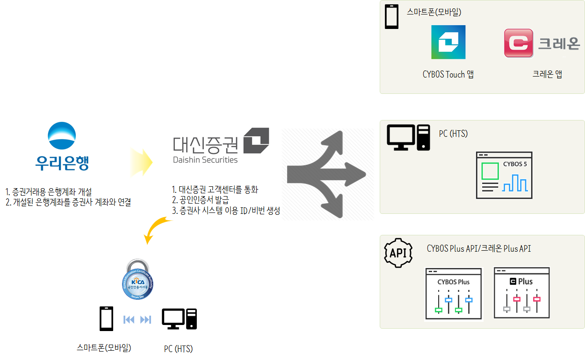

```{r setup, include=FALSE}
knitr::opts_chunk$set(echo = TRUE, message=FALSE, warning=FALSE,
                      comment="", digits = 3, tidy = FALSE, prompt = FALSE, fig.align = 'center')
```

# 주식투자의 시작 {#start-stock-purchase}

주식투자의 시작은 증권계좌 개설부터 시작한다고 볼 수 있다.
먼저 일반 개인 투자자기준 은행연계 증권계좌 개설하고 천만원 거래했을 때 거래 수수료를 비교한다.

# 증권사 수수료 {#trade-fee}

생각보다 다양한 방식으로 수수료를 다양한 거래에 대해서 지불하고 있으며 대표적인 것이 주식 투자 수수료가 이에 포함된다.

- 행정수수료: 흔히 동사무소에서 서류떼는데 드는 비용도 수수료이다.
- 은행/수수료: 은행에서 금융거래를 하는 과정에서 지불하는 수수료.
- **주식 투자 수수료**: 증권사 수수료, 증권거래세
- 비트코인: 출금 수수료
- 사법수수료: 사법시설을 이용하는데 지불하는 수수료. 가장 대표적인 것은, 소장 등을 낼 때 납부하는 인지대

증권사 수수료는 [증권사별 수수료 정리](http://liferootkam.tistory.com/259)를 참조하여 비교하면 다음과 같다.
이 사례를 드는 이유는 웹사이트에서 우클릭하여 복사하여 데이터를 가져오고자 할 경우 웹크롤링을 활용하면 읽기만 가능한 웹사이트에서도
데이터를 긁어올 수 있게 된다.

```{r stock-fees-tistory, eval=TRUE}
library(tidyverse)
library(rvest)

# Sys.setlocale("LC_ALL", "C")

url <- "http://liferootkam.tistory.com/259"

fee_dat <- url %>% 
  read_html() %>% 
  html_node(xpath='//*[@id="content"]/article/div[3]/div/table') %>% 
  html_table() 

# Sys.setlocale("LC_ALL", "Korean")

fee_df <- fee_dat %>% 
  set_names(fee_dat[1,]) %>% 
  filter(row_number() != 1) %>% 
  mutate(`전화주문` = parse_number(`전화주문`) / 100,
         `HTS주문`  = parse_number(`HTS주문`) / 100,
         `MTS주문`  = parse_number(`MTS주문`) /100)

fee_df %>% 
  DT::datatable() %>% 
  DT::formatPercentage(c(2:4), digits = 3)

```

금융투자협회 전자공시서비스 [주식거래 수수료](http://dis.kofia.or.kr/websquare/index.jsp?w2xPath=/wq/compann/DISComdStockTrdCms.xml&divisionId=MDIS02007002000000&serviceId=SDIS02007002000#!)에서 
각 증권사별 주식거래 수수료를 비교할 수 있다. 100만원 주식거래 기준으로 "원, bp"로 표기된 엑셀 파일을 다운로드 받는다.

```{r stock-fees-협회}
library(tidyverse)
library(readxl)

fee_dat <- read_excel("data/주식거래 수수료_20190107.xlsx", sheet="sheet", skip=2)

fee_df <- fee_dat %>% 
  set_names(c("회사명", "수수료_부과기준", "기준일자", "거래금액", "구분", 
              "증권사_오프라인", "증권사_HTS", "증권사_ARS", "증권사_스마트폰", "은행_오프라인", "은행_HTS", 
              "은행_ARS", "은행_스마트폰", "비고")) %>% 
  filter(!is.na(`증권사_오프라인`)) %>% 
  filter(!str_detect(`구분`, "변경율")) %>% 
  group_by(`회사명`) %>% 
  summarise(`구분` = last(`구분`),
            `증권사_오프라인` = last(`증권사_오프라인`),
            `증권사_HTS` = last(`증권사_HTS`),
            `증권사_ARS` = last(`증권사_ARS`),
            `증권사_스마트폰` = last(`증권사_스마트폰`),
            `은행_오프라인` = last(`은행_오프라인`),
            `은행_HTS` = last(`은행_HTS`),
            `은행_ARS` = last(`은행_ARS`),
            `은행_스마트폰`= last(`은행_스마트폰`)) %>% 
  ungroup()

fee_df %>% 
  DT::datatable()

```

데이터를 살펴봤으니 이제 백만원 거래시 "원, bp" 표기된 것을 익숙한 퍼센티지(%)로 변환시켜서 증권사/은행 개설, 오프라인/HTS/ARS/스마트폰 거래 수수료를 비교해보자. 수수료가 없는 것은 제거하고 이를 수수료율과 수수료 기준으로 데이터를 정제한다. 대신증권 은행/스마트폰 HTS 거래의 경우 수수료율이 0.011%로 110원으로 최소인 반면, 
케이프투자증권 은행/증권사 오프라인 거래의 경우 수수료가 6,000원 부과되고 있다.

```{r trade-hts-fees-comparison}
fee_viz_df <- fee_df %>% 
  select(-`구분`) %>% 
  gather(`거래구분`, `수수료`, -`회사명`) %>% 
  mutate(`수수료율` = `수수료` /10^6) %>% 
  filter(!is.na(`수수료`))

fee_viz_df %>% 
  DT::datatable() %>% 
  DT::formatPercentage("수수료율", digits=3) %>% 
  DT::formatRound("수수료", digits=0) 
```

은행개설이 증권사 개설보다 수수료가 저렴한 것이 확인되고, 오프라인 > ARS > HTS/스마트폰 순으로 수수료율이 적은 것이 확인된다.

```{r trade-hts-fees-comparison-viz, fig.width=10, fig.height=8} 
library(extrafont)
loadfonts()

fee_viz_df %>% 
  mutate(`회사명` = str_remove(`회사명`, "증권")) %>% 
  separate(`거래구분`, into=c("금융기관", "거래방식"), sep="_", remove = FALSE) %>% 
  ggplot(aes(x=fct_reorder(`회사명`, -`수수료율`), y=`수수료율`, color=`금융기관`)) +
    geom_point() +
    coord_flip() +
    facet_wrap(~`거래방식`, scale="free") +
    scale_y_continuous(labels=scales::percent) +
    theme_minimal(base_family = "NanumGothic")
```

# 대신증권 사례 {#trade-fee-daishin}

금융투자협회 전자공시서비스 [주식거래 수수료](http://dis.kofia.or.kr/websquare/index.jsp?w2xPath=/wq/compann/DISComdStockTrdCms.xml&divisionId=MDIS02007002000000&serviceId=SDIS02007002000#!) 비교를 통해 
대신증권을 대상으로 계좌를 개설한 경험을 공유드립니다. 그전에 우리은행에서 미래에셋대우 증권 계좌 생성작업을 하다 너무 좋지 못한 경험을 했고,
주식거래 수수료가 가장 적다는 대신증권이 있어 이런 저런 사유로 인해서 대신증권으로 선택을 바꿨습니다.

- [크레온(Creon)](https://www.creontrade.com/)
- [대신증권](https://www.daishin.com/)
- [온라인트레이딩, CYBOS 5](https://money2.daishin.com/E5/WTS/Customer/GuideTrading/DW_Cybos5.aspx?p=4545&v=3383&m=1098)

<style>
div.blue { background-color:#e6f0ff; border-radius: 5px; padding: 10px;}
</style>
<div class = "blue">

질문: 정말 대신증권은 0.011% 거래수수료를 쉽게 받을 수 있게 했을까요? 
아닙니다... HTS, 스마트폰, 스마트폰 비대면 계좌 개설 등 여러 과정을 거쳐야 비로소 가능합니다.

</div>

시중은행을 방문하여 증권거래용 은행계좌 개설하면 통장이 하나 생성된다.
개설된 은행계좌를 증권사 계좌와 연결시키겠다고 개설서류에 사인을 하면 
증권사 계좌번호가 하나 따진다. 이 과정에서 증권계좌 비밀번호도 하나 만들어 둔다.
철저히 비대면이기 때문에 본인확인을 위한 다양한 방법이 동원된다.

예를 들어, 공인인증서 발급관련하여 비밀번호를 분실한 경우 카카오톡과 연동된 카카오페이 공인인증서를 활용하여 
본인인증을 하는 경우 별도 지점에 내방할 필요는 없다.

다음으로 대신증권은 다른 증권사도 다르지 않겠지만, 스마트폰(모바일), PC(HTS), API 거래를 모두 열어두고 있다.
세가지 플랫폼 모두 장단점이 있기 때문에 이를 비교하여 활용한다.




## 대신증권 거래방법별 수수료 [^creon-fee] [^hts-fee] [^daishin-fees] [^cybos-api-fees] {#trade-fee-daishin-type}

[^creon-fee]: [크레온 수수료 안내](https://money2.creontrade.com/E5/WTS/Html/customer/CW_ChargeCreonTrading.aspx)

[^hts-fee]: [사이버 크레이딩 수수료 안내](https://money2.daishin.com/E5/WTS/Customer/Guide/DW_Charge_Cyber.aspx?p=1993&v=2484&m=1093)

[^daishin-fees]: [대신증권 수수료](https://money2.daishin.com/E5/WTS/Customer/Guide/DM_Charge_Cyber.aspx?m=6858&p=6475&v=5451)

[^cybos-api-fees]: [CYBOS Plus API 수수료](https://money2.daishin.com/E5/WTS/Customer/GuideTrading/DW_CybosPlus_Page.aspx?m=9508&p=8812&v=8632)

- 제품: CREON HTS / CREON Plus / CREON Mini(Cybos i) / CREON Mobile / CREON WTS
    - 대상: 유가증권시장 상장주권, 코스닥시장 상장주권,코넥스시장 상장주권, 상장된 출자증권, 신주인수권증서, 수익증권, 신주인수권증권, ELW, ETN
        - 알뜰한수수료: 0.011% (단, K-OTC,K-OTCBB시장 - 0.11%)
        - 스마트수수료: 월정액 15,000원 + 0.0088% (단, K-OTC,K-OTCBB시장 - 월정액15,000 + 0.108%)
- 모바일 (CYBOS Touch, 제휴서비스), ARS
    - 대상: 유가증권시장 상장주권, 코스닥시장 상장주권, 코넥스시장 상장주권, K-OTC 지정주권, K-OTCBB 지정주권, ETN
        - 거래금액에 관계없이 0.1972959%
- HTS/API: CYBOS5(HTS), CYBOS Plus API, CREON Plus API
    - 대상: 유가증권시장상장주권, 코스닥증권시장상장주권, 코넥스시장상장주권, K-OTC지정주권, K-OTC BB 지정주권, 상장된출자증권, 신주인수권증서, 수익증권, 신주인수권증권, ETN
        - 100만원 이하: 0.1672959% + 700원
        - 100만원 초과 500만원 이하: 0.1572959% + 900원
        - 500만원 초과 1천만원 이하: 0.1472959% + 1,000원
        - 1천만원 초과 3천만원 이하: 0.1372959% + 1,200원
        - 3천만원 초과 5천만원 이하: 0.1272959% + 1,500원
        - 5천만원 초과 2억원 이하: 0.0972959%
        - 2억원 초과: 0.0772959%

