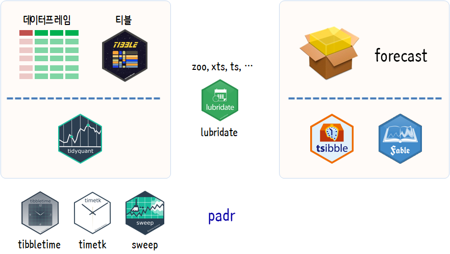
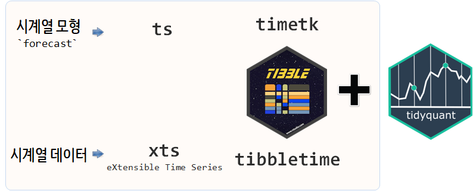
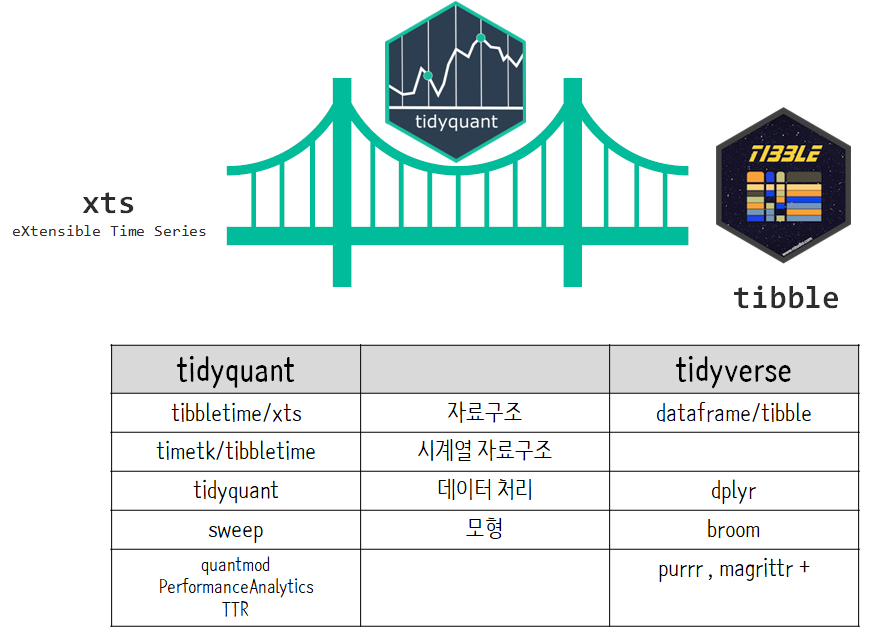

```{r, include=FALSE}
source("tools/chunk-options.R") 
knitr::opts_chunk$set(echo=TRUE, message=FALSE, warning=FALSE)

library(quantmod)
library(Quandl)

options("getSymbols.yahoo.warning"=FALSE)
```

# `tidyverse` 전환기 전쟁 {#tidyverse-time-series-war}

시계열 데이터가 `tidyverse` 변환기를 맞이하여 전쟁이 시작되었다. 과연 누가 전쟁의 승자가 될 것이가?
`tidyverse` 팩키지가 `dplyr`, `tidyr`, `ggplot`, `purrr` 등을 탄탄한 팩키지를 기반으로 하여 
가장 일반적인 데이터에 대해 천하통일을 이루었고, `tidyverse` 생태계는 시계열로 영역을 확장해 나가고 있다.

시계열의 두가지 주된 흐름이 `tidyquant`와 `forecast`의 후속작 `tsibble`, `fable`로 상호 보완적인 면이 있기도 하지만,
서로 경쟁하는 측면이 강하기도 하다. `tidyquant`가 금융데이터를 시작으로 `tidyverse`를 품에 안으려고 추진된 반면,
최근 `forecast`를 유지보수 버젼으로 관리하고 `tsibble`, `fable` 등 R 프로젝트를 새로 시작하는 
[Rob J Hyndman](https://robjhyndman.com/) 교수진영의 약진도 눈부시다.



# 왜 `tidyquant`가 시작되었을까? [^tidyquant-intro] {#tidyquant-overview}

[^tidyquant-intro]: [Davis Vaughan(2018), The future of time series and financial analysis in the tidyverse](https://www.rstudio.com/resources/videos/the-future-of-time-series-and-financial-analysis-in-the-tidyverse/)

시계열 데이터는 일반적으로 많이 다루는 데이터와 비교하여 전혀 다른 생태계를 구축하고 있었다.
`lubridate` 팩키지를 일례로 들면 복잡하고 난잡한 시계열 데이터 처리과정을 개발자 친화적으로 바꾸고자하는 노력이 있었다.

[`tidyverse`](https://github.com/tidyverse/)를 통해서 데이터 분석 및 시각화, 모형개발에 대해서 크나큰 진전이 있었으나,
시계열 데이터에 있어서는 그런 작업이 더디게 진행된다고 생각되었는지 [Business Science](https://github.com/business-science/)에서
`tidyquant` 팩키지를 시작으로 의미있는 작업을 추진하고 있다.

<iframe width="300" height="180" src="https://www.youtube.com/embed/woxJZTL2hok" frameborder="0" allow="autoplay; encrypted-media" allowfullscreen></iframe>

일단, `ts` 객체를 기반으로 `forecast`를 비롯한 수많은 시계열 예측모형이 개발되어 티블 자료형을 `ts` 객체로 변환하는 작업도 필요하고,
시계열 특성을 충분히 발휘할 수 있도록 티블에 새로운 기능을 추가하는 것도 필요하다. 
무엇보다도 `dplyr` 동사를 시계열 데이터에도 사용할 수 있도록 지원하는 것이 우선이다. 
마지막으로 시계열 예측모형에서 나온 객체를 다시 티블로 만들어 이를 재사용하도록 하는 것도 필수적이다.



# `tidyquant` 생태계 {#tidyquant-ecosystem}

[`tidyquant`](https://github.com/business-science/tidyquant)는 시계열 데이터의 [`tidyverse`](https://github.com/tidyverse/) 구축을 추구하고 있다.
이를 위해서 `tidyverse`를 구성하는 어벤저스급 팩키즈에 대응되는 시계열 팩키지를 구축해나가고 있다.

- 자료구조: xts를 기반으로 그 위에 과거 `ts` 객체를 지원하기 위한 [`timetk`](https://github.com/business-science/timetk),
    티블(tibble) 자료구조 위에 시계열 기능을 확장하는 [`tibbletime`](https://github.com/business-science/tibbletime).
- 데이터 처리: 시계열 데이터 처리를 위해서 시계열 데이터 가져오는 `tq_get()`, 시계열 데이터 조작하는 `tq_transmute()`, `tq_mutate()`등 함수와 
    더불어 `tq_performance()`, `tq_portfolio()` 기능을 함수로 제공한다.
- 모형: `forecast` 팩키지 등 기존 시계열 예측모형을 원활히 사용할 수 있도록 `ts` 객체를 손쉽게 만들 수 있도록 지원하는 `timetk` 팩키지,
    시계열 데이터 처리를 한 후에 모형구축 후 생기는 다양한 시계열 모형 객체를 `broom`팩키지와 동일한 기능을 `sweep` 팩키지에서 제공하고 있다.




