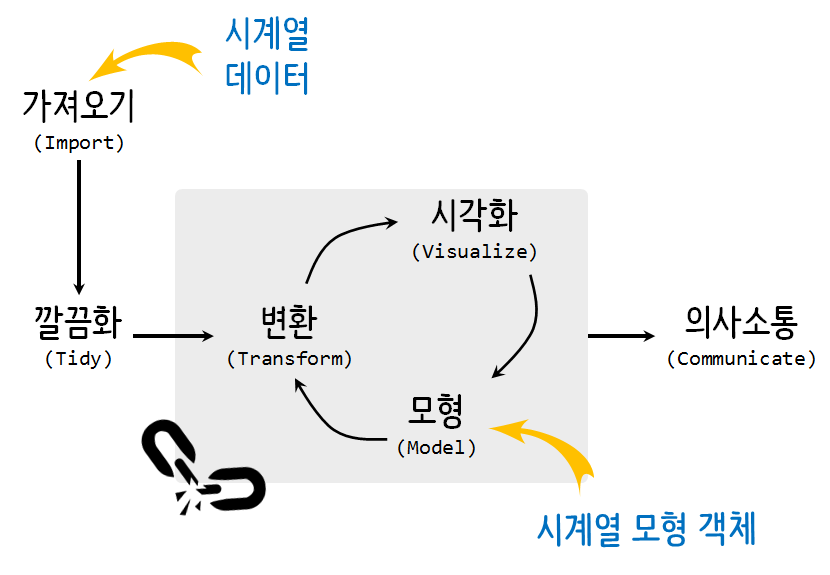
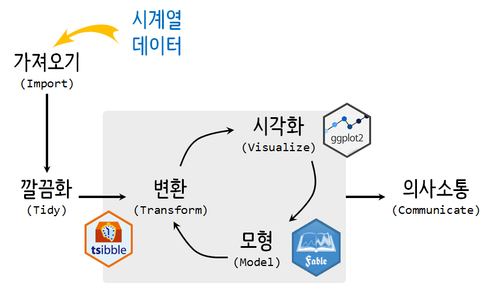

```{r, include=FALSE}
knitr::opts_chunk$set(echo = TRUE, message=FALSE, warning=FALSE,
                      comment="", digits = 3, tidy = FALSE, prompt = FALSE, fig.align = 'center')
```


# `tidyverts` 생태계 [^tidyverts-github] [^melt-the-clock] {#tidyverts-github}

[^tidyverts-github]: [`tidyverts`, "Tidy R packages for time series analysis"](https://github.com/tidyverts)

[^melt-the-clock]: [Earo Wang (2019), "Melt the clck - tidy time series analysis", rstudio::rstudioconf19](https://slides.earo.me/rstudioconf19/#1)

시계열 데이터에 대해서도 `tidyverse` 패러다임을 적용하는 시도가 다수 있었고 그중 하나나 [`tidyverts`, "Tidy R packages for time series analysis"](https://github.com/tidyverts)다.
기존 시계열 데이터를 바탕으로 예측모형을 개발할 경우 통일되지 않은 시계열 자료구조로 인해서 다양한 예측모형이 있음에도 불구하고 
사례별로 시계열 자료구조와 예측모형을 맞춰야하는 문제가 있었다.

  

기존 `forecast` 팩키지는 함수 즉, 예측모형에 신경을 많이 썼다면 `tidyverts`에서는 자료구조에 대해서 관심을 많이 두고 있다.
그 노력의 일환으로 [`tisible`](https://github.com/tidyverts/tsibble)은 시계열 자료구조, 
[`fable`](https://github.com/tidyverts/fable)은 예측모형에 대한 부분을 담당하게 되었다.



# `tidyverts` 헬로월드 {#tidyverts-hello-world}

`nycflights13` 팩키지 `weather` 데이터셋을 가져오면 전형적인 데이터프레임이다.
즉, `time_hour` 변수가 날짜시간(`dttm`) 형태로 담겨져 있다. `origin`이 공항을 나타내고 있으며 `EWR`, `JFK`, `LGA` 3개 지점에서 `2013-01-01 01:00:00` ~ `2013-12-30 18:00:00`까지 날씨에 대해 측정한 정보가 시계열로 들어가 있다.

```{r tidyverts-hello-world}
library(tidyverse)
library(tsibble)

weather <- nycflights13::weather %>% 
  select(origin, time_hour, temp, humid, precip)

weather %>% count(origin)

weather %>% summarise(`첫_시간` = min(time_hour),
                      `마지막_시간` = max(time_hour))
```

## `tsibble` 객체 변환 {#tidyverts-hello-world-tsibble}

상기 데이터프레임으로 `tsibble` 시계열 자료구조로 변경하게 되면 시킬 수 있다.
이를 위해서 `index`에 시계열 변수를 `key`에 식별변수를 지정한다.
`index` + `key`를 통해 시계열 기본키가 준비된다.

- integer/numeric: either “unit” or “year” (Y)
- yearquarter/yearqtr: “quarter” (Q)
- yearmonth/yearmon: “month” (M)
- yearweek: “week” (W)
- Date: “day” (D)
- POSIXct: “hour” (h), “minute” (m), “second” (s), “millisecond” (us), “microsecond” (ms)
- nanotime: “nanosecond” (ns)

```{r tidyverts-hello-world-tsibble}
weather_tsbl <- as_tsibble(weather, key = id(origin),
                                    index = time_hour)

weather_tsbl
```

## `tsibble` 연산작업 {#tidyverts-hello-world-tsibble-operation}

`dplyr` 동사에 친숙한 경우, `group_by()` + `summarize()` 콤보 연산은
`tsibble` 팩키지 `index_by()` + `summarize()` 콤보연산에 대응된다. 
예를 들어 현재 시간대별로 나눠진 데이터를 일자별로 요약할 경우 
날짜/시간 &rarr; 날짜로 변환하는데 `as_date()` 함수를 사용하고,
`index_by()` 함수로 날짜별로 최대, 최소 온도를 구해서 새로운 자료형을 만들 수 있다.


```{r tidyverts-hello-world-tsibble-operation}
weather_tsbl %>%
  group_by(origin) %>%
  index_by(date = as_date(time_hour)) %>% 
  summarise(
    temp_high = max(temp, na.rm = TRUE),
    temp_mean = mean(temp, na.rm = TRUE),
    temp_low = min(temp, na.rm = TRUE)
  )
```

## 불규칙 시계열 {#tidyverts-hello-world-tsibble-irregular}

`tsible`은 기본디폴트 설정으로 규칙적인 시계열 데이터를 염두에 두고 있다. 
시계열이 불규칙적인 경우 `regular = FALSE`를 지정하여 이를 반영하고 
`index_by()` + `summarize()` 콤보연산으로 추후 보정한다.

`nycflights13` 팩키지 `flights` 데이터프레임을 시계열 데이터 관점에서 살펴보자.
먼저 `make_datetime()` 함수로 시계열 데이터를 생성시킨다.

```{r tidyverts-hello-world-tsibble-operation-irregular}
flights <- nycflights13::flights %>%
  mutate(sched_dep_datetime = 
    lubridate::make_datetime(year, month, day, hour, minute, tz = "America/New_York"))
```

`carrier`, `flight`를 키값으로 삼아 앞서 생성한 `sched_dep_datetime`를 시계열 `index`로 삼는 다. `regular = FALSE` 인자를 명시적으로 선언해서 불규칙 시계열임을 확실히 한다.
이를 통해서 `336,776 x 20 [!]`으로부터 `[!]`을 통해 불규칙 시계열임을 확인할 수 있게된다.

```{r tidyverts-hello-world-tsibble-operation-irregular-run}
flights_tsbl <- flights %>%
  as_tsibble(
    key = id(carrier, flight), 
    index = sched_dep_datetime, 
    regular = FALSE
  )
flights_tsbl
```


# 시계열 애니메이션 {#tidyverts-hello-world-tsibble}

공항별(`dplyr`) 월별(`tsibble`) 온도변화(`ggplot`) 애니메이션(`gganimate`)을 조합하여 
순차적으로 파이프에 연결시키게 되면 월별 혹은 경우에 따라서는 일별 시각화 애니메이션을 수월하게 작성시킬 수 있다.

```{r tsibble-tidyverts-animation}
library(gganimate)
library(lubridate)
library(extrafont)
loadfonts()

weather_tsbl %>%
  group_by(origin) %>%
  index_by(date = month(time_hour)) %>% 
  summarise(
    temp_high = max(temp, na.rm = TRUE),
    temp_mean = mean(temp, na.rm = TRUE),
    temp_low = min(temp, na.rm = TRUE)
  )  %>% 
  ggplot(aes(x=date, y=temp_mean, group = origin, color=origin)) + 
    geom_line() + 
    geom_point(size = 2) + 
    transition_reveal(date) +
    geom_text(aes(x = 13, label = origin), hjust = 0) +
    geom_segment(aes(xend = 13, yend = temp_mean), linetype = 2, colour = 'grey') +
    coord_cartesian(clip = 'off') + 
    labs(title = '뉴욕 공항 2013년 온도변환', y = '화씨 온도 (°F)',
         x="2013년 월",
         subtitle = '공항별(dplyr) 월별(tsibble) 온도변화(ggplot) 애니메이션(gganimate)') + 
    theme_minimal(base_family = "NanumGothic") + 
    theme(legend.position = "none")
    
```


## 이동평균 시계열 애니메이션 {#tidyverts-hello-world-tsibble-ma}

`tsibble` 팩키지 `purrr` 함수형 프로그래밍 기법을 적용하여 시계열 데이터에 이동평균을 계산하여 이를 시각화할 수 있다. 월별 이동평균(`.size = 30`)을 계산하여 앞서 개발한 애니메이션에 파이프로 연결시켜 애니메이션 시각화를 구현시킨다.


```{r tsibble-tidyverts-animation-ma}
weather_tsbl %>%
  filter(origin == "JFK") %>%
  index_by(date = yday(time_hour)) %>% 
  summarise(
    temp_mean = mean(temp, na.rm = TRUE),
  ) %>% 
  mutate(ma_monthly = slide_dbl(temp_mean, ~ mean(.), .size = 30)) %>% 
  ggplot(aes(x=date, y=temp_mean)) + 
    geom_line() + 
    geom_point(size = 2) + 
    geom_point(aes(x=date, y=ma_monthly, size = 2), color="red") + 
    geom_line(aes(x=date, y=ma_monthly, color="red"), size=1.5) +
    geom_text(aes(x = 365, label = temp_mean), hjust = 0) +
    geom_segment(aes(xend = 365, yend = temp_mean), linetype = 2, colour = 'grey') +
    geom_text(aes(x = 365, y=ma_monthly, label = ma_monthly), hjust = 0) +
    geom_segment(aes(xend = 365, y=ma_monthly, yend = ma_monthly), linetype = 2, colour = 'red') +
    transition_reveal(date) +
    coord_cartesian(clip = 'off') + 
    labs(title = '뉴욕 공항 2013년 온도변환', y = '화씨 온도 (°F)',
         x="2013년 일별",
         subtitle = '공항별(dplyr) 일별(tsibble) 온도변화(ggplot) 애니메이션(gganimate)') + 
    theme_minimal(base_family = "NanumGothic") + 
    theme(legend.position = "none")

```
