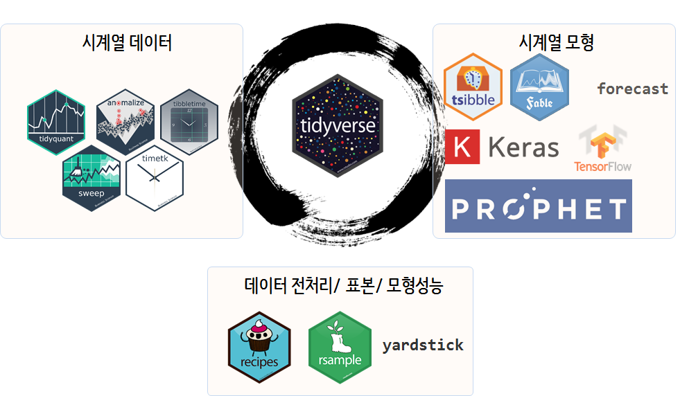

```{r, include=FALSE}
source("tools/chunk-options.R") 
knitr::opts_chunk$set(echo=TRUE, message=FALSE, warning=FALSE)

library(tidyverse)

# Time Series
library(timetk)
library(tidyquant)
library(tibbletime)
library(sweep)

# Visualization
library(cowplot)

# Modeling
library(forecast)
```


# 태양흑점수 데이터 [^sunspot-lstm] {#time-series-forecasting-sunspot-data}

[^sunspot-lstm]: [Matt Dancho(April 18, 2018), "TIME SERIES DEEP LEARNING: FORECASTING SUNSPOTS WITH KERAS STATEFUL LSTM IN R"](http://www.business-science.io/timeseries-analysis/2018/04/18/keras-lstm-sunspots-time-series-prediction.html)

AirPassengers 데이터가 시계열의 **붓꽃(iris) 데이터**로 추세(trend), 변동성(heteroscedasticity), 계절성을 갖는 데이터라면,
태양흑점수(sunspot) 데이터는 주기(cycle)와 진폭(amplitude)의 변화로 인해 예측모형을 만들기가 쉽지않다.
이런 점에서 기존 시계열 예측모형을 적합해서 그 한계를 먼저 확인하는 것도 의미가 클 것으로 보인다.

# 시계열 데이터 작업흐름 {#time-series-forecasting-tidyverse-workflow}

시계열 데이터는 최근 `tidyverse` 생태계를 중심으로 제편되고 있고, 
시계열 진영도 예외가 아니다. 시계열 데이터의 특성을 반영하여 `tidyquant` 툴체인과,
시계열 모형도 과거 `forecast` 팩키지를 확장한 `fable`, 딥러닝 계열의 `keras`, 페이스북의 `prophet`이 
모형쪽에서 신형 예측모형으로 두각을 나타내고 있으며, `recipes`, `rsample`, `yardstick`도 데이터 전처리, 
표본추출, 모형성능을 든든하게 지원하고 있다.



# 태양 흑점수 예측 [^sunspot-deep-learning] [^time-series-sweep] {#time-series-sunspot-forecasting-data}

[^sunspot-deep-learning]: [Time Series Deep Learning, S&P Global’s headquarters on April 19th, 2018.](https://github.com/business-science/presentations/tree/master/2018_04_19_SP_Global_Time_Series_Deep_Learning)

[^time-series-sweep]: [Matt Dancho(October 25, 2017), "DEMO WEEK: TIDY FORECASTING WITH SWEEP"](http://www.business-science.io/code-tools/2017/10/25/demo_week_sweep.html)

## 데이터와 시각화 {#time-series-sunspot-forecasting-data-viz}

`datasets` 팩키지에 포함된 태양 흑점수 월별 데이터(`sunspot.month`)를 기존 `ts` 객체에서 데이터프레임으로 변환작업을 하는데
`time_tk` 인덱스를 갖는 객체로 변환시킨다. 
그리고 나서, 예측모형을 적합시키기 전에 시각화를 통해 데이터와 친숙해진다.

``` {r time-series-sunspot-forecasting-data-viz}
library(tidyverse)
library(timetk)
library(tidyquant)
library(tibbletime)
library(sweep)
library(cowplot)
library(forecast)

# 1. 데이터 -----
## 1.1. 데이터 가져오기 ----
sunspots_dat <- datasets::sunspot.month %>%
  tk_tbl() %>%
  mutate(date = as_date(index)) %>%
  select(date, value) %>% 
  as_tbl_time(index = date)

## 1.2. 훈련/시험 데이터 분리 ----

sunspots_train_df <- sunspots_dat %>% 
  filter(date <= "2011-12-01")

sunspots_test_df <- sunspots_dat %>% 
  filter(date > "2011-12-01")

## 1.2. 데이터 시각화 ----

sunspot_p1 <- sunspots_train_df %>%
  ggplot(aes(date, value)) +
  geom_point(color = palette_light()[[1]], alpha = 0.5) +
  theme_tq(base_family = "NanumGothic") +
  labs(title = "태양 흑점 갯수 (1749~2013)", x="", y="흑점갯수")

sunspot_p2 <- sunspots_train_df %>%
  filter_time("start" ~ "1800") %>%
  ggplot(aes(date, value)) +
  geom_line(color = palette_light()[[1]], alpha = 0.5) +
  geom_point(color = palette_light()[[1]]) +
  geom_smooth(method = "loess", span = 0.2, se = FALSE) +
  theme_tq(base_family = "NanumGothic") +
  labs(title = "태양 흑점 갯수 (1749~1759)",
       subtitle = "흑점 주기를 명확히 보여주기 위해서 확대",
       x="", y="흑점갯수",
       caption = "datasets::sunspot.month")

sunspot_p_title <- ggdraw() + 
  draw_label("태양 흑점수(Sunspots)", size = 18, fontface = "bold", colour = palette_light()[[1]], fontfamily="NanumGothic")

plot_grid(sunspot_p_title, sunspot_p1, sunspot_p2, ncol = 1, rel_heights = c(0.1, 1, 1))
```


## ARIMA 모형 적합 {#time-series-sunspot-forecasting-arima}

모형 예측을 위해서 `tk_ts()` 함수로 `ts` 객체로 변환시키고 `auto.arima()` 함수로 최적 예측모형을 생성히킨다.
`sw_glance()` 함수로 모형성능을 일별하고 나서 잔차검증을 통해 모형적합성을 검증한다.

``` {r time-series-sunspot-forecasting-arima}
# 2. 시계열 예측 모형 -----
## 2.1. 티블을 ts로 변환
sunsplot_ts <- tk_ts(sunspots_train_df, start = 1749, freq = 12)

has_timetk_idx(sunsplot_ts) # sw_sweep()을 사용할 때 매우 중요한 요소.....

## 2.2. 예측모형 적합: ARIMA, TBATS
sunspot_arima_fit <- auto.arima(sunsplot_ts)
# sunspot_tbats_fit <- tbats(sunsplot_ts)

## 2.3. 예측모형 성능평가
sw_glance(sunspot_arima_fit) %>% 
  glimpse()

## 2.4. 예측모형 검증 - 잔차
sw_augment(sunspot_arima_fit, timetk_idx = TRUE) %>% 
  ggplot(aes(x = index, y = .resid)) +
  geom_point() + 
  geom_smooth(method="loess", color="blue", size=1, se=FALSE) +
  geom_hline(yintercept = 0, color = "red") + 
  scale_x_date(date_breaks = "50 year", date_labels = "%Y") +
  theme_tq(base_family = "NanumGothic") +
  labs(title = "ARIMA 잔차",
       x="", y="잔차(Residual)",
       caption = "datasets::sunspot.month, 모형: ARIMA")
```

## ARIMA 모형 적합 {#time-series-sunspot-forecasting-arima}

`forecast()` 함수를 사용해서 태양흑점수를 예측한다. 
예측값을 `sw_sweep()` 함수를 사용해서 원본데이터, 예측흑점수, 신뢰구간도 함께 하나의 데이터프레임으로 저장시켜서 
후속 분석작업에 활용한다.

``` {r time-series-sunspot-forecasting-arima-forecast}
## 2.5. 태양 흑점수 예측
sunspot_fcst_df <- forecast(sunspot_arima_fit, h = 21) %>% 
  sw_sweep(., timetk_idx = TRUE)

sunspot_fcst_df %>% 
  arrange(desc(index)) %>% 
    DT::datatable() %>% 
    DT::formatRound(c(3:7), digits = 0)
```

## ARIMA 모형 적합 {#time-series-sunspot-forecasting-arima-viz}

태양흑점수를 `ggplot`으로 시각화하여 마무리한다.

``` {r time-series-sunspot-forecasting-arima-forecast-viz}
# 3. 모형결과 정리 -----
## 3.1. 전체기간 -----
sunsplot_full_p <- sunspot_fcst_df %>%
  ggplot(aes(x = index, y = value, color = key)) +
  # 95% 신뢰구간
  geom_ribbon(aes(ymin = lo.95, ymax = hi.95), 
              fill = "#D5DBFF", color = NA, size = 0) +
  # 80% 신뢰구간
  geom_ribbon(aes(ymin = lo.80, ymax = hi.80, fill = key), 
              fill = "#596DD5", color = NA, size = 0, alpha = 0.8) +
  # 태양 흑점수 예측값
  geom_line() +
  geom_point() +
  # 실제 태양 흑점수
  geom_line(aes(x = date, y = value), color = palette_light()[[1]], data = sunspots_test_df) +
  geom_point(aes(x = date, y = value), color = palette_light()[[1]], data = sunspots_test_df) +
  theme_tq(base_family = "NanumGothic") +
  labs(title = "태양흑점수 예측: ARIMA",
       x="", y="흑점수",
       caption = "datasets::sunspot.month, 모형: ARIMA") +
  scale_x_date(date_breaks = "50 year", date_labels = "%Y") +
  scale_color_tq() +
  scale_fill_tq()
  
## 3.2. 최근(1950년 이후) -----
sunsplot_recent_p <- sunspot_fcst_df %>%
  filter(index >= "1950-01-01") %>% 
  ggplot(aes(x = index, y = value, color = key)) +
  # 95% 신뢰구간
  geom_ribbon(aes(ymin = lo.95, ymax = hi.95), 
              fill = "#D5DBFF", color = NA, size = 0) +
  # 80% 신뢰구간
  geom_ribbon(aes(ymin = lo.80, ymax = hi.80, fill = key), 
              fill = "#596DD5", color = NA, size = 0, alpha = 0.8) +
  # 태양 흑점수 예측값
  geom_line() +
  geom_point() +
  # 실제 태양 흑점수
  geom_line(aes(x = date, y = value), color = palette_light()[[1]], data = sunspots_test_df) +
  geom_point(aes(x = date, y = value), color = palette_light()[[1]], data = sunspots_test_df) +
  theme_tq(base_family = "NanumGothic") +
  labs(title = "태양흑점수 예측: ARIMA",
       x="", y="흑점수",
       caption = "datasets::sunspot.month, 모형: ARIMA") +
  scale_x_date(date_breaks = "50 year", date_labels = "%Y") +
  scale_color_tq() +
  scale_fill_tq()

## 3.3. 그래프 결합 -----
sunspot_fcst_title <- ggdraw() + 
  draw_label("태양 흑점수(Sunspots) 예측", size = 18, fontface = "bold", colour = palette_light()[[1]], fontfamily="NanumGothic")

plot_grid(sunspot_fcst_title, sunsplot_full_p, sunsplot_recent_p, ncol = 1, rel_heights = c(0.1, 1, 1))
```

