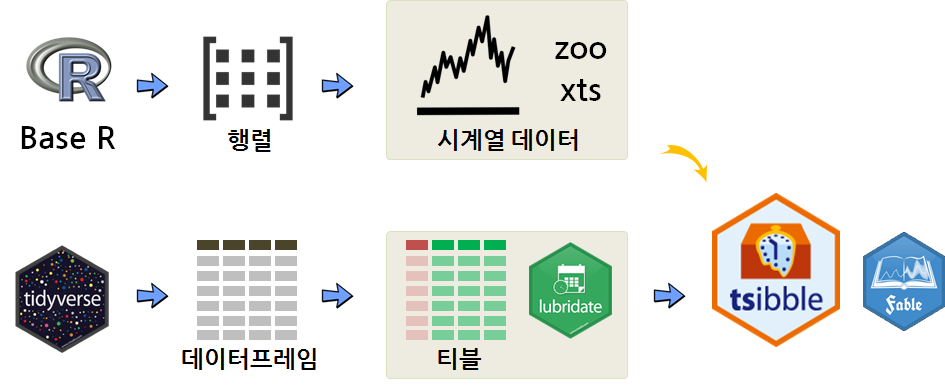

```{r, include=FALSE}
knitr::opts_chunk$set(echo = TRUE, message=FALSE, warning=FALSE,
                      comment="", digits = 3, tidy = FALSE, prompt = FALSE, fig.align = 'center')
```


# 시계열 데이터 역학관계 {#time-series-dynamics}

R에서 시계열 데이터를 처리하기 위한 전용 자료구조로 [`zoo`, Z's Ordered Observations](https://cran.r-project.org/web/packages/zoo/)와 [`xts`, eXtensible Time Series](https://github.com/joshuaulrich/xts)가 많이 활용되었지만, `tidyverse` 등장이후 시계열 자료구조도 
[`lubridate`](https://cran.r-project.org/web/packages/lubridate/) 팩키지의 등장 이후 시계열이 아닌 많이 사용되는 데이터프레임에서 표준으로 자리를 잡아가고 있으며 [`tsibble`](https://cran.r-project.org/web/packages/tsibble/)이 두가지 큰 흐름의 간극을 매워가면서 새로운 지평을 열어가고 있다.



# `tsibble` 기본 [^tsibble-vignette] {#time-series-tsibble}

[^tsibble-vignette]: [Earo Wang, "Introduction to tsibble - Vignette"](https://cran.r-project.org/web/packages/tsibble/vignettes/intro-tsibble.html)


