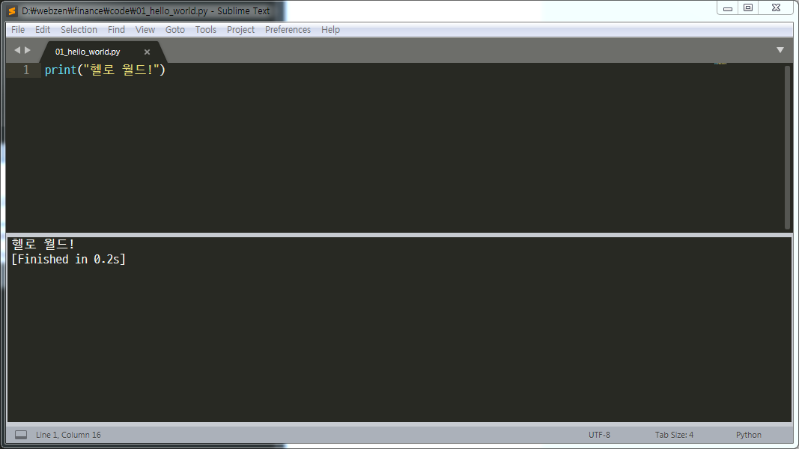
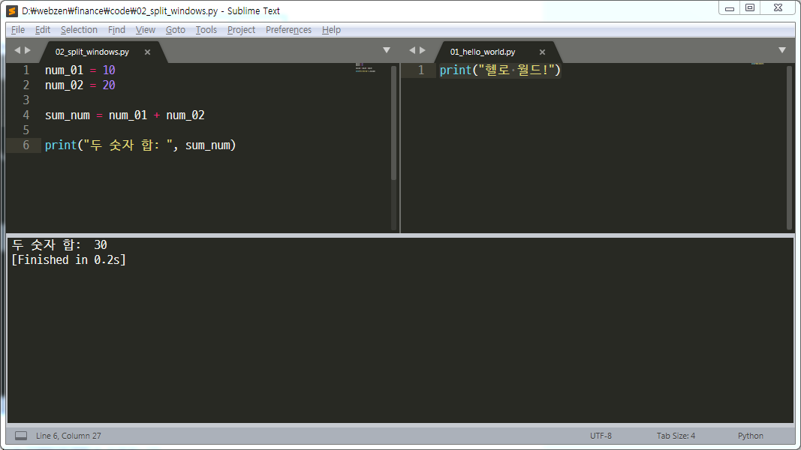
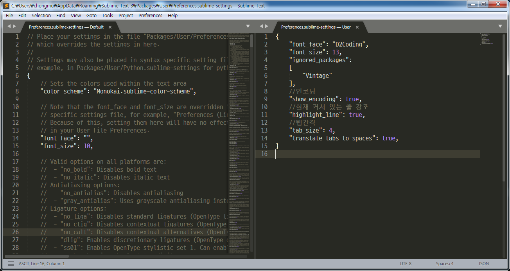

```{r setup, include=FALSE}
knitr::opts_chunk$set(echo = TRUE, message=FALSE, warning=FALSE,
                      comment="", digits = 3, tidy = FALSE, prompt = FALSE, fig.align = 'center')
```

# 주식투자 API [^증권사API] {#financial-stock-api}

[^증권사API]: [위키백과, "대한민국의 금융투자회사 수수료 및 API 목록"]](https://ko.wikipedia.org/wiki/대한민국의_금융투자회사_수수료_및_API_목록)

위키백과사전 대한민국의 금융투자회사 수수료 및 API 목록을 통해 API를 제공하는 증권사가 그리 많지 않은 것을 알 수 있다.
대다수 증권사에서 제공하는 API는 파이썬을 기본 언어로 제공하기 때문에 파이썬 기본 준비를 해보자.

| 금융투자회사      | API 제공여부  |
|-------------------|---------------|
| SK증권            |      제공     |
| 한화증권          |      제공     |
| 대신증권          |      제공     |
| 하이투자증권      |      제공     |
| 우리투자증권      |      제공     |
| 신한금융투자      |      제공     |
| 키움증권          |      제공     |
| 이베스트투자증권  |      제공     |
| 미래에셋대우      |      제공     |
| 동양증권          |      제공     |
| 하나대투증권      |      제공     |
| IBK투자증권       |      제공     |

# 서브라임 텍스트 파이썬 환경설정 [^서브라임-파이썬] {#financial-stock-api-sublime}

[^서브라임-파이썬]: [Sublime Text 3와 함께 Python 프로그래밍(Windows / Ubuntu)](https://webnautes.tistory.com/454)

파이썬과 서브라임 편집기를 설치한다. 파이썬에 내장된 IDLE을 사용해도 되지만 Sublime Text3와 같은 전용 편집기를 사용하는 것도 권장된다.

- [파이썬](https://www.python.org/)
- [서브라임 텍스트 3 편집기](https://www.sublimetext.com/3) 

윈도우 `cmd`를 열고 `where python` 명령어를 타이핑하게 되면 설치된 파이썬을 확인할 수 있다.

``` {r python-windows, eval=FALSE}
C:\Users\me> where python
C:\ProgramData\Anaconda3\python.exe
C:\Python34\python.exe
```

# 헬로월드 {#financial-stock-api-sublime-hello-world}

파이썬 프로그래밍의 처음은 아무래도 헬로 월드를 찍는 것부터 시작된다.

`print("헬로 월드!")` 출력문장을 `01_hello_world.py` 파일에 담아 저장시키고 나서 
`Ctrl + B` 키를 타이핑하게 되면 선택메뉴가 나오는데 `Python`을 선택하게 되면 파이썬 엔진으로 실행결과를 
하단에 출력시킨다.



# 창분할 {#financial-stock-api-sublime-split-windows}

`Alt + Shift + 8` 단축키를 통해 창분할을 행으로 할 수 있고,
`Alt + Shift + 2` 단축키를 통해 창분할을 열로 할 수 있고,
`Alt + Shift + 1` 단축키는 분할된 창을 다시 원래대로 복구시킨다. 
동일한 방식으로 창을 `Ctrl + B` 단축키를 통해 파이썬 프로그램을 실행시킬 수 있다.




# 코딩 폰트 및 크기 설정 {#financial-stock-api-sublime-font}

즐거운 코딩의 시작은 가독성 좋은 선호하는 폰트로 코딩하는 것이 출발점이 될 것이다.
[D2 Coding 글꼴](https://github.com/naver/d2codingfont)을 윈도우에 폰트로 등록시키면 
Sublime Text에서 기본 코딩 폰트로 활용이 가능하다. 그외 파이썬 프로그래밍의 중요한 탭을 공백 4개로 변환시키는 기능도 넣어둔다.
이를 위해서 메뉴에서 `Preferences  > Settings`를 선택하게 되면 다음과 같은 창이 열린다.

`Preferences.sublime-settings -- User`에 다음과 같이 폰트를 비롯한 관련 내용을 저장시킨다.


``` {r sublime-text-font, eval=FALSE}
{
  "font_face": "D2Coding",
  "font_size": 13,
  "ignored_packages":
  [
    "Vintage"
  ],
  //인코딩
  "show_encoding": true,
  //현재 커서 있는 줄 강조
    "highlight_line": true,
    //탭간격
    "tab_size": 4,
    "translate_tabs_to_spaces": true,
}
```



# 플러그인(Plugin) 설치 {#install-plugin-on-sublime}

Sublime Text 편집기가 강력한 이유는 이를 지원하는 다양한 플러그인이 존재하기 때문이다.
안드로이드폰이 구글 `플레이` 스토어가 있기 때문에 게임 뿐만 아니라 다양한 응용프로그램 어플을 통해 많은 사용자를 갖게된 것과 
유사하다. 이를 위해서 [Sublime Text Package Control Installation](https://packagecontrol.io/installation) 페이지에서 안내에 맞춰
`Package Control`을 설치한다.

메뉴에서 `View` &rarr; `Show Console`으로 가는 것도 가능하고 단축키로 ctrl+``을 누른다.
그리고 안내에 따라 하단창에 복사해서 붙여넣고 실행시키면 된다.

[팩키지](https://packagecontrol.io/)를 찾아보고 파이썬 프로그래밍에 도움이 되는 플러그인(plugin)을 설치한다.


# `SublimeREPL` 팩키지 설치 {#install-plugin-on-sublime-repl}

`Ctrl + Shift + P` 를 입력했을 때 "Package Control: Install Package"가 뜨고 필요한 팩키지를 설치한다.
먼저 `SublimeREPL` 팩키지를 설치하여 인터랙티브 파이썬 프로그램 개발을 가능하게 한다.


<style>
div.blue { background-color:#e6f0ff; border-radius: 5px; padding: 10px;}
</style>
<div class = "blue">

**`sublime there are no packages available for installation` 오류** [^package-install-error]

[^package-install-error]: [木白no1 (2017), "Solve sublime text can not install plugin problem"](https://www.jianshu.com/p/23d1ec6988e5)

Sublime Text Package Control을 통해 플러그인을 설치하지 못하는 경우가 있다. 

`Preferences` > `Package Settings` > `Package Control` > `Settings - User`으로 가서 다음 사항을 반영한다.

``` {r fix-plugin-error, eval=FALSE}
"channels":
    [
        "http://cst.stu.126.net/u/json/cms/channel_v3.json",
        //"https://packagecontrol.io/channel_v3.json",
        //"https://web.archive.org/web/20160103232808/https://packagecontrol.io/channel_v3.json",
        //"https://gist.githubusercontent.com/nick1m/660ed046a096dae0b0ab/raw/e6e9e23a0bb48b44537f61025fbc359f8d586eb4/channel_v3.json"
    ],
```

</div>


# `SublimeLinter-flake8` 팩키지 설치 {#install-plugin-on-sublime-repl}

`SublimeLinter` 플러그인은 실시간 문법 검사기능을 제공한다.

# `SublimeCodeIntel` 팩키지 설치 {#install-plugin-on-sublime-sublimecodeintel}

`SublimeCodeIntel` 플러그인은 키워드 입력도중에 자동완성 가능한 키워드들을 출력하는 기능을 제공한다.