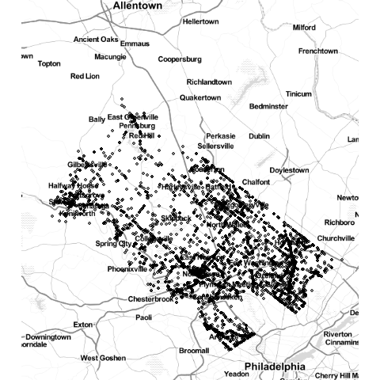
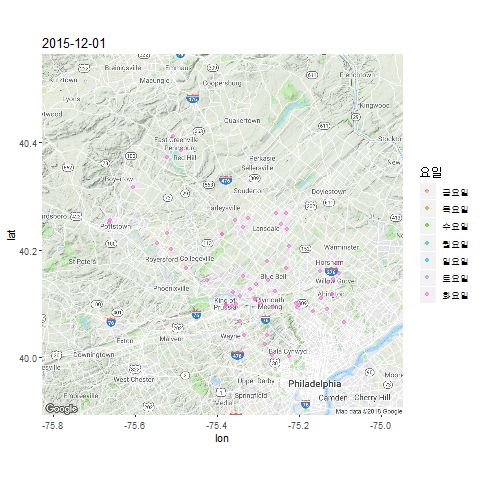

```{r, include=FALSE}
source("tools/chunk-options.R") 
knitr::opts_chunk$set(echo=TRUE, message=FALSE, warning=FALSE)

library(tidyverse)
# library(statisticalModeling)
library(xts)
library(quantmod)
```

# 시계열 데이터 {#time-series-data-taste}


**시계열 데이터(time series)**는 시간 순서로 배열된 데이터의 한 종류로 시간에 걸쳐
순차적으로 기록된다. 시계열 데이터는 널려있다고 해도 과언은 아니다.
주식수익률 데이터를 포함한 재무데이터, 인플레이션, 소비자 물가를
포함한 각종 경제 관련 데이터 및 시간순으로 정당 지지율도 대표적인 시계열 데이터가 된다.

날짜와 시간을 어떻게 R 자료구조로 표현하는 방법과 실무에서 자주 등장하는 불규칙한 시계열 데이터를 일정 간격을 갖는 시계열 데이터로 변환하는 방법에 대해서는 
다음 웹사이트를 참고한다.


## 시계열 데이터 팩키지와 자료구조 [^eric-zivot-time-series]

[^eric-zivot-time-series]: [Eric Zivot(2014), "Working with Financial Time Series Data in R"](https://faculty.washington.edu/ezivot/econ424/Working%20with%20Time%20Series%20Data%20in%20R.pdf)

| 팩키지     | 시계열 객체 |                 상세 설명                           |
|------------|-------------|-----------------------------------------------------|
| fts        | `fts`       | C++ 시계열 라이브러리 `tslib`에 대한 R 인터페이스   |
| its        | `its`       | 불규칙 시계열 데이터를 처리하는 S4 클래스           |
| tseries    | `irts`      | "POSIXct" 색인을 갖는 불규칙 시계열 객체            |
| timeSeries | `timeSeries`| Rmetrics 팩키지 시계열 유틸리티                     |
| tis        | `tis`       | 시간 색인과 시계열 데이터를 위한 S3 함수와 클래스   |
| stats      | `ts`, `mts` | 일정한 시간 간격을 갖는 시계열 객체                 |
| zoo        | `zoo`       | 불규칙 시계열을 포함하고 전체 관측점을 시계열 순으로 색인한 S3 클래스  |
| xts        | `xts`       | zoo 클래스 확장                                     |


시계열 데이터를 R에서 담아내는 객체는 다양하다. C++ `tslib`을 R로 가져온 것부터 가장 최근 `xts` 팩키지까지 다양한 방식이 동원된다.
시계열 데이터를 자료구조로 이해할 경우 먼저 등간격을 갖는 일정한 시간 데이터인지, 불규칙한 시간 데이터인지 판단을 해야하고,
그 다음으로 색인여부가 속도와 연관되어 시계열 데이터를 이해하는 중요한 기준이 될 수 있다.

시계열 데이터가 `tidyverse` 변환기를 맞이하여 전쟁이 시작되었고, 
주도권 쟁탈전도 R을 시작한 뿌리가 달라 금융진영에서 시작된 `tidyquant` 계열과, 
전통 시계열 예측(`forecast`)에서 시작된 `tsibble`, `fable` 계열로 나뉘어져 약진하고 있다.

시계열 데이터에 대한 승자가 누가 되던간에 `tidyverse` 생태계 `dplyr`, `tidyr`, `ggplot`, `purrr` 등을 탄탄한 
팩키지에 대한 후위 호환성(backword compatibility)를 염두에 두고 서로의 기능을 내세워 
더 많은 사용자를 흡수하고자 노력을 많이 할 것이다.


### 시계열 `ts` 객체 [^time-series-ts-objects]

Base 팩키지에 포함된 `ts` 함수를 사용하면 간단한 시계열 데이터를 생성시킬 수 있다.
특히 `window` 함수를 활용하여 특정 기간 데이터도 쉽게 뽑아낼 수 있다.

``` {r time-series-data-input}
# 0. 환경설정 --------------------------------------------------------------
library(tidyverse)
library(lubridate)
library(xts)

# 1. 시계열 데이터 --------------------------------------------------------------
## 1.1. 처음부터 생성------------------------------------------------------------
dat <- c(7,5,3,1,3,5,7)
dat_ts <- as.ts(dat)
dat_ts

dat_1987_ts <- ts(dat, start=1987)
dat_1987_ts

dat_quarter_ts <- ts(dat, start=c(1987,3), frequency=4)
dat_quarter_ts

# 특정기간 뽑아내기
window(dat_quarter_ts, start=c(1987,3), end=c(1988,4))
```

> **시계열 자료구조를 활용하는 이유**  
> 
> 시계열 자료구조를 활용하는 이유는 다음 맥주생산량 데이터를 통해 이해하면 쉽다.
> 시계열 자료구조가 아닌 경우 `plot` 함수에 던지게 되면 산점도를 찍게 되지만,
> 시계열 자료구조를 갖는 경우 각 관측점을 연결한 시각화 산출물을 생성시킨다.
> 
> `xts` 팩키지를 활용하면 불규칙, 규칙 시계열 데이터를 자체 색인을 통해 빠르게 접근하고 
> 다양한 시계열 데이터를 자유로이 다룰 수 있는 도구상자를 지원한다.

``` {r time-series-data-import, message=FALSE, warning=FALSE}
## 1.2. 데이터셋에서 불러오기----------------------------------------------------
# 맥주생산량 데이터
beer_df <- read_csv("https://raw.githubusercontent.com/jamesrobertlloyd/gp-structure-search/master/data/raw/TSDL/monthly-beer-production-in-austr.csv") 
names(beer_df) <- c("dtime", "beer")

beer_df <- beer_df %>% dplyr::filter(!is.na(beer)) %>% mutate(dtime=ymd(paste0(dtime,"-01")))

# ts 변환
head(beer_df)
tail(beer_df)
beer_ts <- ts(beer_df[,-1], start=c(1956,01), frequency=12)

par(mfrow=c(1,2))
plot(beer_df, main="시계열 정보 활용 못함", xlab="", ylab="맥주생산량")
plot(beer_ts, main="시계열 정보 활용 직선으로 연결함", xlab="", ylab="맥주생산량")

# xts 변환
beer_xts <- as.xts(beer_df[,-1], order.by=beer_df$dtime)

par(mfrow=c(1,1))
plot(beer_xts)
```

### 시계열 데이터 시각화 [^time-series-sunsplot]

[^time-series-sunsplot]: [The sunspot numbers plotted in different-sized boxes, demonstrating that the dimensions of the graphic matters when displaying time series data](http://www.stat.pitt.edu/stoffer/tsa4/tsaEZ.pdf)

시계열 데이터를 시각화할 경우 시계열 시간이 항상 시계열 관측값보다 긴 것이 좋다.
태양의 흑점수(sunspot)를 관측한 데이터의 특징은 흑점개수가 빠르게 증가하고 느리게 감소하는 경향이 있는데
상단 그래프(시간축이 관측축보다 긴 경우)는 이런 경향이 잘 관찰되지만, 
하단 그래프(시간축과 관측축이 동일한 경우)는 이런 경향을 확인하기 상대적으로 쉽지 않다.

``` {r time-series-warning}
# 2. 시각화----------------------------------------------------
library(graphics)
data(sunspot.year)

layout(matrix(c(1:2, 1:2), ncol=2), height=c(.2,.8))

par(mar=c(.2,3.5,0,.5), oma=c(3.5,0,.5,0), mgp=c(2,.6,0), tcl=-.3, las=1)

plot(sunspot.year, type='n', xaxt='no', ylab='')
  grid(lty=1, col=gray(.9))
  lines(sunspot.year)
  
plot(sunspots, type='n', ylab='')
  grid(lty=1, col=gray(.9))
  lines(sunspot.year)

title(xlab="시간", outer=TRUE, cex.lab=1.2)
mtext(side=2, "태양의 흑점개수", line=2, las=0, adj=.75)
```

# 시계열 데이터 가져오기 {#time-series-manipulation-ingest}

시계열 데이터가 널려 있고, 널려있는 시계열 데이터를 가져오는 방법은 다양한 금융/재무/경제 데이터 저장소에서 가져올 수 있다.

이에 대한 자세한 사항은 [데이터 과학 – 금융(Finance): 금융데이터 가져오기](https://statkclee.github.io/finance/finance-data-import.html)를 참조한다.

## 시계열 1 종 가져오기 {#time-series-manipulation-ingest-one}


`quantmod` 팩키지와 `xts`를 기본으로 하여 `getSymbols()` 함수를 통해 아마존을 대상으로 살펴보자.
`getSymbols` 함수로 야후나 구글에서 주식데이터를 긁어오면 시가, 종가 등 다양한 정보를 아래 함수를 혹은 조합해서 활용이 가능하다.

- Op() : 개장가격(opening price)
- Hi() : 최고가(high price)
- Lo() : 최저가(low price)
- Cl() : 마감 종가(close price)
- Vo() : 거래량(traded volume)
- Ad() : 조정된 마감 종가(adjusted close price)


``` {r getSymbols-one-stock}
library(xts)
library(quantmod)
# 1. 데이터 긁어오기 ----------------------------------

getSymbols("AMZN", src="yahoo", auto.assign = TRUE, from = "2018-05-01")

# 2. 특정 칼럼 뽑아내기 ----------------------------------
## 2.1. 한 칼럼만 뽑아내기
head(Op(AMZN), 3)
head(Hi(AMZN), 3)
head(Lo(AMZN), 3)
head(Cl(AMZN), 3)
head(Vo(AMZN), 3)
# head(Ad(AMZN), 3)

## 2.2. 칼럼 다수 뽑아내기

head(OHLC(AMZN), 3)
```

## 시계열 주식 데이터 다수 가져오기 {#time-series-manipulation-ingest-multiple}

주식 데이터 다수를 가져열 경우 일단 `new.env()` 함수로 다수 주식데이터를 담아놓는 공간을 마련한다.
그후 split-apply-combine 전략을 적용한다.

``` {r getSymbols-multiple-stocks}
# 3. 다수 데이터 긁어오기 ----------------------------------

data_env <- new.env()
getSymbols(c("AMZN", "AAPL"), env = data_env, src="yahoo", auto.assign = TRUE, from = "2018-01-01")

## 3.1. 다수 데이터 종가 가져오기

data_lst <- lapply(data_env, Cl)
(closed <- do.call(merge, data_lst) %>% head)
```

## 시계열 데이터 다루기 - `padr` [^padr-emergency] {#time-series-padr-manipulation}

[^padr-emergency]: [Thats so Random(2017-03-19), "Preparing Datetime Data for Analysis with padr and dplyr"](https://edwinth.github.io/blog/padr-examples/)

`padr` 팩키지는 두가지 목적을 명확히 하고 개발되었다.

- 시계열 데이터가 시분초 단위로 되어 있지만, 분석은 년월일 단위로 시계열 데이터 분석을 추진하고자 할 때 생기는 문제에 대한 해법 제시.
- 시계열 관측점이 없는 경우 결측값을 보정하는 경우.

이런 경우 [`padr`](https://github.com/EdwinTh/padr) 팩키지 `thicken()` 함수와 `pad()` 함수를 `tidyr::fill()` 함수와 결합하여 사용할 경우 
많은 문제를 풀 수 있다. 다음은 [Preparing Datetime Data for Analysis with padr and dplyr](https://edwinth.github.io/blog/padr-examples/) 블로그 포스트에 
게시된 `padr`을 `dplyr`과 결합해서 사용할 경우 예시를 들어 살펴본다.

### 응급전화 데이터 {#time-series-padr-manipulation-data}

`padr` 팩키지에 `emergency` 데이터가 포함되어 있다. 
필라델피아 몽고메리 카운티의 응급실 전화내용을 기록한 것으로 2015-12-10 시점부터 2016-10-17 09:47:03 까지의 내용이 기록되어 있다.

- lat: 위도 
- lng: 경도
- zip: 우편번호
- title: 응급 범주 분류
- time_stamp: YYYY-MM-DD HH:MM:SS 응급전화 등록시점
- twp: Township, 군구(郡區: county 아래의 행정 구역 단위)

### 월별 응급유형 분류 {#time-series-padr-manipulation-monthly}

응급실로 걸려오는 응급유형이 많은 관계로 가장 전화가 많은 12개 주요 응급유형을 분류하여 데이터프레임을 생성한다.
그리고 나서, 월별 `thicken()`함수로 데이터를 축약해서 이를 `geom_bar()` 함수로 시각화한다.

``` {r padr-time-series-data}
# 0. 팩키지 -----
library(tidyverse)
library(padr)

# 1. 데이터 -----
top12_df <- emergency %>% count(title) %>% arrange(desc(n)) %>% slice(1:12) %>% 
  select(title) %>% inner_join(emergency)

# 2. 월별 응급실 방문 사고 추이 -----
top12_df %>% 
  arrange(time_stamp) %>% 
  thicken('month', col = 'month') %>% 
  count(title, month) %>%
  ggplot(aes(month, n)) +
  geom_bar(aes(fill = title), 
           col = "black",
           stat = 'identity', 
           position = "fill")
```

### 시간대별 응급유형 분류 {#time-series-padr-manipulation-monthly}

`thicken()`함수를 시간대별로 축약하고 `NA` 결측값이 생길 경우 `pad()` 함수로 응급유형을 그룹짓어 결측값을 `fill_by_value()` 함수로 채워넣는다.
그리고 나서 시간대와 응급유형별로 `ggplot()`을 사용해서 시각화한다.

``` {r padr-time-series-data-hour}
# 3. 시간 단위별로 응급실 방문사고 분포 ----

hourly_distribution_df <- top12_df %>% 
  arrange(time_stamp) %>% 
  thicken('hour') %>% 
  count(title, time_stamp_hour) %>% 
  pad(group = 'title') %>% 
  fill_by_value(n) 

hourly_distribution_df %>% 
  mutate(clock_hour = lubridate::hour(time_stamp_hour) ) %>% 
  group_by(clock_hour, title) %>% 
  summarise(mn = mean(n)) %>% 
  ggplot(aes(clock_hour, mn)) +
  geom_line() + 
  facet_wrap(~title, scales = 'free')
```

### 30번째 관측점 시각화 {#time-series-padr-manipulation-monthly-30th}

`thicken()`함수로 주별 요약을 하고 주별 30번째 응급유형을 막대그래프로 시각화한다.

``` {r padr-time-series-30th-bar}
# 4. 시간 단위별로 30번째 관측점 추출 -----

first_day <- top12_df$time_stamp %>% as.Date %>% min
first_day %>% weekdays

top12_df %>% 
  arrange(time_stamp) %>% 
  thicken('week', start_val = first_day - 3) %>% 
  group_by(title, time_stamp_week) %>% 
  filter(min_rank(time_stamp) == 30) %>% 
  mutate(weekday = weekdays(time_stamp) %>% 
           factor(levels = (c('월요일', '화요일', '수요일', '목요일', '금요일',
           '토요일', '일요일') %>% rev) )) %>%
  ggplot(aes(weekday)) +
    geom_bar(aes(fill = title)) +
    coord_flip() +
    guides(fill = FALSE) +
    facet_wrap(~title)
```

### 이동평균 {#time-series-padr-manipulation-moving-average}

`thicken()` 함수로 일별 요약 통계량을 구하고 나서, 결측값을 `pad()` 함수로 채워넣고 
`RcppRoll` 팩키지 `roll_meanr()` 함수로 30일 이동평균을 계산해서 이를 겹쳐 시각화한다. 

``` {r padr-time-series-moving-average}
# 5. 이동 평균 -----
top12_df %>% thicken('day', col = 'day') %>% 
  count(day, title) %>% 
  pad(group = 'title') %>% fill_by_value(n) %>% 
  group_by(title) %>% 
  mutate(moving_average = RcppRoll::roll_meanr(x = n, n = 30, fill = NA)) %>% 
  ggplot(aes(day, n)) + 
  geom_line() +
  geom_line(aes(y = moving_average), col = 'red') +
  facet_wrap(~title, scales = 'free')
```

## 시계열 데이터 다루기 - `tibbletime` {#time-series-tibbletime-manipulation}

`padr`과 달리 `tibbletime`은 `tbl_time()`함수를 통해 자료구조를 바꿔줘야 하는 과정을 거치게 된다.


### `ggmap` 응급전화 위치 시각화 [^ggmap-imagemagick-convert] {#time-series-ggmap-viz}

[^ggmap-imagemagick-convert]: [Where is ImageMagicks convert.exe?](http://manuelmeyer.net/2016/06/where-is-imagemagicks-convert-exe/)

`ggmap` 팩키지 `qmplot()` 함수를 통해 위도경도 정보가 포함된 경우 수월하게 시각화를 할 수 있다.
`convert.exe` 실행프로그램은 `ImageMagicks`을 윈도우에 설치될 때 기본제공에서 빠져있다.
이유는 보안 취약점 때문에 제거되어기 때문에 `gganimate` 팩키지로 `gif` 파일을 제작할 경우 특히, 윈도우에서 고생을 할 수 있다.
해결책은 보안 취약점을 무릅쓰고 `convert.exe` 파일을 `ImageMagicks` 설치단계에서 `Install legency utilities(e.g. covnert)`를 클릭하여 
포함시키는 것이다.

``` {r time-series-manipulation-tibbletime, eval=FALSE}
# 0. 팩키지 -----
library(tibbletime)
library(ggmap)
library(gganimate)

# 1. 데이터 -----
# top12_df <- emergency %>% count(title) %>% arrange(desc(n)) %>% slice(1:12) %>% 
#  select(title) %>% inner_join(emergency)

top12_tbl <- tbl_time(top12_df, index = time_stamp)

# 2. gganimate 시각화 -----
top_12_plot <- top12_tbl %>% 
  collapse_by(period = "1 month", clean = TRUE, side = "start") %>% 
  filter(lng >-76, lat > 39) %>% 
  qmplot(lng, lat, data = ., geom = "blank") +
  geom_point(aes(frame = time_stamp), 
             alpha = .5)

gganimate(top_12_plot)
```




### `ggmap` 응급전화 위치 시각화2 [^ggmap-lovetoken] {#time-series-ggmap-viz2}

[^ggmap-lovetoken]: [Lovetoken(18 Oct 2016), "R에서 ggmap, ggplot2 패키지를 이용한 지도 출력 및 경로 표현하기 간단예제"](https://lovetoken.github.io/r/data_visualization/2016/10/18/ggmap.html)

`qmplot()` 함수 대신 `ggmap`의 `get_googlemap()` 함수로 지도를 받아오고, `geom_point()` 함수를 그 위에 얻어 시각화하는 것도 가능하다.

``` {r time-series-manipulation-tibbletime-ggmap2, eval=FALSE}
# 3. ggmap 시각화 -----

pa_map <- get_googlemap("Montgomery County, PA") %>% ggmap

top_12_plot_df <- top12_tbl %>% 
  collapse_by(period = "1 month", clean = TRUE, side = "start") %>% 
  filter(lng >-76, lat > 39) %>% 
  sample_frac(0.01) %>% 
  mutate(weekday = weekdays(as.Date(time_stamp)))

top_12_ggmap <- pa_map +
  geom_point(data=top_12_plot_df, 
             aes(x=lng, y=lat, color=as.factor(weekday),
                 frame = time_stamp), alpha = .5) +
  labs(color="요일") 

gganimate(top_12_ggmap)
```

