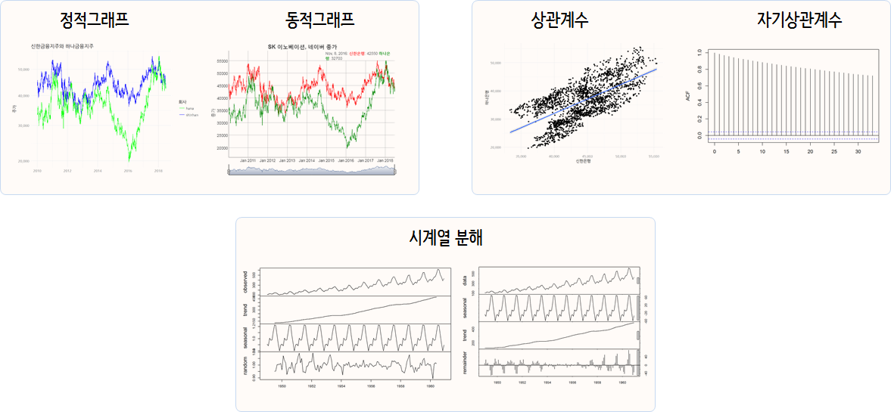

```{r, include=FALSE}
knitr::opts_chunk$set(echo=TRUE, message=FALSE, warning=FALSE)

library(tidyverse)
library(xts)
library(cowplot)
library(extrafont)
loadfonts()

```


# 시계열 데이터 도구상자 [^yahoo-finance-data] {#yahoo-financial-data-toolbox} 

[^yahoo-finance-data]: [Plotting Time Series in R using Yahoo Finance data](http://blog.revolutionanalytics.com/2015/08/plotting-time-series-in-r.html)

시계열 데이터 입수과정부터 시각화를 통한 사전 분석 도구를 살펴보고, 
시계열 데이터 (자기)상관 계수를 이해하고, `acf()` 자기상관계수를 시각화하여 ARMA 모형 식별에 대한 단초로 활용한다.
마지막으로 가법, 승법 시계열 분해방법에 대해 살펴본다.

금융 시계열 데이터, 특히 주식관련 데이터는 [야후 파이낸스](https://finance.yahoo.com/) 통해서 신뢰성 높은 데이터를 
빠른 시간내 획득할 수 있고, `quantmod`, `tidyquant` 팩키지를 통해 다른 경제, 금융관련 데이터도 손쉽게 가져올 수 있다.
금융/경제/재무 데이터를 가져오는 방법에 대해서는 [데이터 과학 – 금융(Finance): 금융데이터 가져오기](https://statkclee.github.io/finance/finance-data-import.html)를 
참조한다.



## 시계열 데이터 분석환경 {#yahoo-financial-data-packages} 

금융 시계열 데이터로 작업을 할 경우 가장 먼저 시계열 데이터를 조작해야 되는데,
이런 경우 `zoo` 를 확장한 `xts` 팩키지를 많이 사용했고, 최근에는 `tibbletime`, `tsibble` 등 티블(tibble) 데이터프레임에
시계열 데이터를 다룰 수 있는 기능을 추가한 자료구조도 등장했다. 
정적 시계열 데이터 시각화에는 `ggplot2` 팩키지, 동적 시계열 데이터 시각화에는 `dygraphs` 팩키지를 장착하여 
시계열 분석에 활용하는 것이 일반적이다.

``` {r time-series-financial-data-setup}
library(tidyverse)
library(tidyquant)
library(cowplot)
library(extrafont)
loadfonts()
library(dygraphs)
```

## 금융 데이터 가져오기 {#yahoo-financial-data-import} 

금융 데이터를 가져올 때 `tidyquant` 팩키지 `tq_get()`함수를 사용한다.
이를 위해서 [Yahoo Finance](https://finance.yahoo.com/)에서 신한금융지주(055550.KS)와 
하나금융지주(086790.KS) 주식코드를 확인하고 데이터를 가져온다.

``` {r time-series-financial-data-import, message=FALSE}
# 야후 금융데이터 -----------------------------------------------------------
# https://finance.yahoo.com/

# 신한금융지주와 하나금융지주
shinhan_df  <- tq_get("055550.KS", get = "stock.prices", from = "2010-01-01")
hana_df     <- tq_get("086790.KS", get = "stock.prices", from = "2010-01-01")

```

## 정적 시계열 시각화 {#yahoo-financial-data-static-viz}

정적 그래프를 통해 시각화하는 경우 `ggplot`, 인터랙티브 동적 그래프를 통해 시각화하는 경우 `dygraphs` 를 활용한다.
먼저, `ggplot`을 통한 정적 시계열 시각화를 시도해 본다.

``` {r time-series-financial-data-viz}
# 주식시세 시각화 -------------------------------------------------------------
# 정적 시각화

ggplot(shinhan_df, aes(date, close)) + 
  geom_line(aes(color="shinhan"), size=0.5) +
  geom_line(data=hana_df, aes(color="hana"), size=0.5) +
  labs(
    title = "신한금융지주와 하나금융지주",
    x = "",
    y = "주가",
    color = "회사") + 
    scale_colour_manual(values = c("green", "blue")) +
  theme(plot.title = element_text(lineheight=.7, face="bold", family="NanumGothic")) +
  theme_minimal(base_family = "NanumGothic") +
  scale_y_sqrt(label=scales::comma)
```


## 동적 시계열 시각화 {#yahoo-financial-data-dynamic-viz}

`dygraphs`로 동적시계열 시각화를 하는 것도 가능하다. 
이를 위해서는 먼저 자료구조를 데이터프레임에서 `xts`로 변환시켜야하고, `dygraph` 문법에 맞춰 시각화한다.

``` {r time-series-financial-data-viz-dygraph}
# 동적 시각화
shinhan_xts   <- xts(shinhan_df$close, order.by=shinhan_df$date, frequency=365)
hana_xts <- xts(hana_df$close,  order.by=hana_df$date, frequency=365)

korea_stocks <- cbind(shinhan_xts, hana_xts)
names(korea_stocks) <- c("Shinhan", "Hana")

dygraph(korea_stocks, ylab="종가", main="SK 이노베이션, 네이버 종가") %>%
  dySeries("Shinhan", label="신한은행") %>%
  dySeries("Hana", label="하나은행") %>%
  dyOptions(colors = c("red","green")) %>%
  dyRangeSelector()
```

## 시계열 데이터 산점도 {#yahoo-financial-data-scatterplot}

신한은행과 하나은행 두 기업 주가 및 일별 수익률을 산점도로 찍어보면 상관관계를 확인할 수 있다.

``` {r time-series-yahoo-scatterplot}
# 상관계수 -------------------------------------------------------------------

shinhan_df <- shinhan_df %>% 
  select(date, shinhan=close)

hana_df <- hana_df %>% 
  select(date, hana=close)

korea_stock_df <- inner_join(shinhan_df, hana_df, by="date")

korea_stock_df %>% 
  ggplot(aes(x=shinhan, y=hana)) +
    geom_point() +
    geom_smooth(method='lm') +
    theme_minimal(base_family="NanumGothic") +
    labs(x="신한은행", y="하나은행",
         title="신한은행과 하나은행 주가 산점도") +
    scale_x_continuous(label=scales::comma) +
    scale_y_continuous(label=scales::comma)

```

## 주식 수익률 {#yahoo-financial-data-return}

신한은행과 하나은행 수익률을 함께 시각화한다.

``` {r time-series-yahoo-scatterplot-return}
# 수익률
korea_stocks_diff <- diff(log(korea_stocks), diff=1)

par(mfrow=c(1,2))

xts::plot.xts(korea_stocks_diff)

korea_stocks_diff_df <- data.frame(korea_stocks_diff)

plot(korea_stocks_diff_df$Shinhan, korea_stocks_diff_df$Hana)
```

## 시계열 데이터 상관계수 {#yahoo-financial-data-cor}

신한은행와 하나은행 두 회사 주가 및 주식수익률에 대한 상관계수도 계산할 수 있다.
`cor()` 함수를 통해 상관계수를 계산해도 좋지만, [상관계수 네트워크 분석](https://statkclee.github.io/network/tidygraph-correlation.html#13_%EC%83%81%EA%B4%80%EB%B6%84%EC%84%9D)을 참고하여 
`corrr` 팩키지를 활용하여 `correlate()`, `shave()` 함수가 유용할 수도 있다.

``` {r time-series-correlation}
library(corrr)
cor(korea_stock_df[,2:3])
korea_stocks_diff[-1,] %>% 
  correlate() %>%
  shave(upper = TRUE)
```

## 자기상관계수(Autocorrelation) {#yahoo-financial-data-autocorrelation}

자기상관계수는 시계열에서 매우 중요한 역할을 차지하고 있다.
시계열 데이터의 자기상관은 시차를 1, 2, ... 등 여러 시차를 두고 자기상관을 크게 갖을 수 있다.

``` {r time-series-naver-lag-scatterplot}

p1 <- ggplot(shinhan_df, aes(date, shinhan)) + 
  geom_line() +
  labs(
    title = "신한은행 종가",
    y="주가") + 
  theme(plot.title = element_text(lineheight=.7, face="bold", family="NanumGothic"))

# 시차 1을 갖는 시계열 산점도 그리기
shinhan_lag_df <- as.data.frame(cbind(shinhan_df$shinhan[-length(shinhan_df$shinhan)], shinhan_df$shinhan[-1]))
colnames(shinhan_lag_df) <- c("shinhan_t", "shinhan_t_1")

p2 <- ggplot(shinhan_lag_df, aes(shinhan_t, shinhan_t_1)) + 
  geom_line() +
  geom_point(alpha=0.3) +
  labs(
    title = "신한은행 1시차 종가",
    x=expression(신한은행[t-1]),
    y=expression(신한은행[t])
  ) + theme(plot.title = element_text(lineheight=.7, face="bold", family="NanumGothic"))

cowplot::plot_grid(p1, p2, ncol=2)
```

수작업으로 자기상관계수를 계산하는 방식은 다음과 같고, `acf` 함수를 활용하면 이를 쉽게 계산도 하고,
시각적으로 확인도 가능하다.


``` {r time-series-naver-acf, message=FALSE}
# 네이버 주식 상관계수 ------------------------------------------------------------------------------
cor(shinhan_lag_df$shinhan_t, shinhan_lag_df$shinhan_t_1)

acf(shinhan_df$shinhan, lag.max = 2, plot = FALSE)

acf(shinhan_df$shinhan, plot = TRUE)
```


# 시계열 분해 [^time-series-decomposition] {#yahoo-time-series-toolbox}

[^time-series-decomposition]: [Decomposition of time series](https://en.wikipedia.org/wiki/Decomposition_of_time_series)

- 계절성($S_t$): 계절변동(Seasonality)은 계절적 요인으로 일정한 주기를 갖고 반복적으로 유사한 패턴으로 변화하는 것으로 항상 고정되고 이미 알려진 주기를 갖는다.
- 추세성($T_t$): 시계열의 장기적인 진화과정을 반영하는 것으로 상승 혹은 하락 방향성이 있을 때 존재하고 반듯이 선형일 필요는 없다.
- 순환성($C_t$): 반복되나 주기성이 없는 변동을 반영하는 것으로 통상적으로 적어도 2년의 기간이 필요하다.
- 불규칙성($I_t$): 불규칙성(Irregularity)은 랜덤으로 비정규적인 영향을 반영하는 것으로 계절성, 추세성, 순환성이 제거된 후 남은 단차 부분을 반영한다.

가법 모형(additive model)으로 상기 구성요소를 시계열 모형을 표현하면 다음과 같다.

$$y_t = T_t + C_t + S_t + I_t$$

승법 모형(multiplicative model)으로 상기 구성요소를 시계열 모형을 표현하면 다음과 같다.

$$y_t = T_t \times C_t \times S_t \times I_t$$

특히, `loess`를 활용한 STL(Seasonal and Trend decomposition using Loess)는 순환성이 추세성에 반영된 계절성($S_t$)과 추세성($T_t$)만으로 시계열을 분해하는데
비선형성은 `loess()`가 그 역할을 담당한다.

**STL**을 활용한 장점은 [Forecasting: principles and practice, STL decomposition](https://www.otexts.org/fpp/6/5)에 설명되어 있다.


## 가법 시계열 분해: 수작업 [^time-series-decomp-tutorial] {#yahoo-time-series-toolbox-additive}

[^time-series-decomp-tutorial]: [Extract Seasonal & Trend: using decomposition in R](https://anomaly.io/seasonal-trend-decomposition-in-r/)

### 원본 데이터 {#yahoo-time-series-toolbox-additive-raw-data}

`fpp` 팩키지 포함된 `ausbeer` 데이터를 시각화한다.

``` {r time-series-ausbeer-decomposition}
# 환경설정 ------------------------------------------------------------------------
library(fpp)

# 1. 가법 시계열분해---------------------------------------------------------

data(ausbeer)
ausbeer_ts <- ts(tail(head(ausbeer, 17*4+2),17*4-4), frequency = 4)
plot(ausbeer_ts)
```


### 추세 제거 {#yahoo-time-series-toolbox-additive-trend}

원본데이터에서 추세를 제거하고, 제거된 추세를 시각화한다.

``` {r time-series-ausbeer-decomposition-trend}
par(mfrow=c(1,2))
## 1.1. 추세 제거------------------------------------------------------------
trend_beer <- ma(ausbeer_ts, order = 4, centre = T)
plot(ausbeer_ts)
lines(trend_beer)

detrend_beer <- ausbeer_ts - trend_beer
plot(detrend_beer)
```

### 계절성과 불규칙성 {#yahoo-time-series-toolbox-additive-seasonality-irregular}

원본데이터에서 추세를 제거했으니, 계절성을 제거하고 남은 불규칙성을 차례로 시각화해보자.

``` {r time-series-ausbeer-decomposition-trend-irregular}
## 1.2. 계절성------------------------------------------------------------
par(mfrow=c(1,2))
# m_beer <- t(matrix(data = detrend_beer[-c(1,2)], nrow = 4))
m_beer <- t(matrix(data = detrend_beer, nrow = 4))
seasonal_beer <- colMeans(m_beer, na.rm = T)
seasonal_beer <- ts(rep(seasonal_beer,16), start=1956, frequency=4)
plot(seasonal_beer)

## 1.3. 불규칙성------------------------------------------------------------
seasonal_beer <- colMeans(m_beer, na.rm = T)
random_beer <- ausbeer_ts - trend_beer - seasonal_beer
plot(random_beer)
```

### 복원 {#yahoo-time-series-toolbox-additive-recompose}

원본데이터에서 추출한 추세, 계절성, 불규칙성을 가법모형으로 결합하여 원데이터를 복원한다.

``` {r time-series-ausbeer-decomposition-trend-recompose}
## 1.4. 복원------------------------------------------------------------
par(mfrow=c(2,1), family="NanumGothic")
par(mar=c(2, 2, 1.5, 2), xaxs='i', yaxs='i')
recomposed_beer <- (trend_beer + seasonal_beer + random_beer)
plot(ausbeer_ts, main="원본 맥주 데이터",  xaxt="n")
plot(recomposed_beer, main="시계열 재합성 맥주 데이터")
```

## 승법 시계열 분해: 수작업 {#yahoo-time-series-toolbox-multiplicative}

시계열의 `iris` 데이터 `AirPassengers` 데이터를 대상으로 승법 시계열 분해작업을 수행한다.

### 원본 데이터 {#yahoo-time-series-toolbox-multiplicative-data}

``` {r time-series-ap-decomposition}
# 2. 승법 시계열분해---------------------------------------------------------
data(AirPassengers)
ap_ts <- AirPassengers
plot(ap_ts)
```

### 추세 제거 {#yahoo-time-series-toolbox-multiplicative-data-trend}

`ma()` 함수로 추세를 추출하고 이를 승법모형으로 반영해서 추세를 제거한다.

``` {r time-series-ap-decomposition-detrend}
par(mfrow=c(1,2))
## 1.1. 추세 제거------------------------------------------------------------
trend_ap <- ma(ap_ts, order = 12, centre = T)
plot(ap_ts)
lines(trend_ap)

detrend_ap <- ap_ts / trend_ap
plot(detrend_ap)
```

### 계절성과 불규칙성 {#yahoo-time-series-toolbox-multiplicative-data-trend-seasonality}

계절성을 뽑아내고, 추세와 계절성을 뽑아내고 남은 불규칙성을 시각화한다.

``` {r time-series-ap-decomposition-detrend-seasonality}
par(mfrow=c(1,2))
## 1.2. 계절성------------------------------------------------------------
ap_mat <- t(matrix(data = detrend_ap, nrow = 12))
seasonal_ap <- colMeans(ap_mat, na.rm = T)
plot(as.ts(rep(seasonal_ap,12)))

## 1.3. 불규칙성------------------------------------------------------------
random_ap <- ap_ts / (trend_ap * seasonal_ap)
plot(random_ap)
```

### 복원 {#yahoo-time-series-toolbox-multiplicative-data-recompose}

승법모형으로 추출한 각 구성요소를 곱해서 원시계열 데이털르 복원한다.

``` {r time-series-ap-decomposition-recompose}
## 1.4. 원시계열 복원------------------------------------------------------------
par(mfrow=c(2,1), family="NanumGothic")
par(mar=c(2, 3, 1.5, 2), xaxs='i', yaxs='i')

recomposed_ap <- (trend_ap * seasonal_ap * random_ap)
plot(ap_ts, main="원본 항공여객 데이터", xaxt="n")
plot(recomposed_ap, main="시계열 재합성 항공여객 데이터")
```

## 가법 시계열 분해: 자동화 {#yahoo-time-series-additive-decompose}

`decompose()` 함수 가법모형으로 `ausbeer_ts` 시계열 데이터를 자동으로 분해한다.

``` {r time-series-ausbeer-decomposition-fn-auto-additive}
# 2. 수작업 자동화, decompose(), stl() ------------------------------------
par(mfrow=c(2,2))
# 가법모형
decompose_beer  <- decompose(ausbeer_ts, "additive")

plot(ausbeer_ts)
plot(decompose_beer$seasonal)
plot(decompose_beer$trend)
plot(decompose_beer$random)

par(mfrow=c(1,1))
plot(decompose_beer)
```

## 승법 시계열 분해: 자동화 {#yahoo-time-series-multiplicative-decompose}

동일하게 `decompose()` 함수에 `multiplicative` 인자를 넣어 승법모형으로 `ausbeer_ts` 시계열 데이터를 자동으로 분해한다.

``` {r time-series-ap-decomposition-fn-auto-multi}
par(mfrow=c(2,2))
# 승법모형
decompose_air <- decompose(ap_ts, "multiplicative")

plot(ap_ts)
plot(decompose_air$seasonal)
plot(decompose_air$trend)
plot(decompose_air$random)

par(mfrow=c(1,1))
plot(decompose_air)
```

## `stl()` 자동화 {#yahoo-time-series-ausbeer-decompose-stl}

`stl`, "Seasonal Decomposition of Time Series by Loess" 방법론으로 시계열 분해도 가능하다.

### 맥주 데이터 시계열 분해  {#yahoo-time-series-ausbeer-decompose-stl-ausbeer}

``` {r time-series-ausbeer-decomposition-stl}
# stl() : ausbeer 데이터 ------------------------------------
par(mfrow=c(2,2))
stl_beer <- stl(ausbeer_ts, s.window = "periodic")
seasonal_stl_beer <- stl_beer$time.series[,1]
trend_stl_beer <- stl_beer$time.series[,2]
random_stl_beer <- stl_beer$time.series[,3]

plot(ausbeer_ts)
plot(seasonal_stl_beer)
plot(trend_stl_beer)
plot(random_stl_beer)

par(mfrow=c(1,1))
plot(stl_beer)
```

### 항공여객 데이터 시계열 분해 {#yahoo-time-series-ausbeer-decompose-stl-airpassenger}

``` {r time-series-ap-decomposition-stl}
# stl() : 항공여객 데이터 ------------------------------------
par(mfrow=c(2,2))
ap_stl <- stl(ap_ts, s.window = "periodic")
seasonal_ap_stl <- ap_stl$time.series[,1]
trend_ap_stl <- ap_stl$time.series[,2]
random_ap_stl <- ap_stl$time.series[,3]

plot(ap_ts)
plot(seasonal_ap_stl)
plot(trend_ap_stl)
plot(random_ap_stl)

par(mfrow=c(1,1))
plot(ap_stl)
```